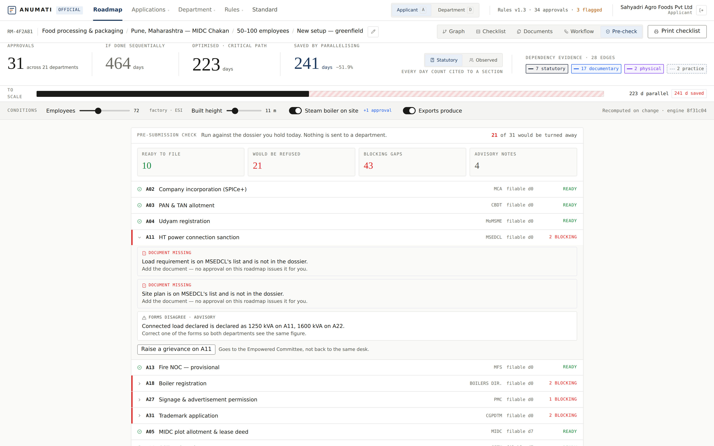
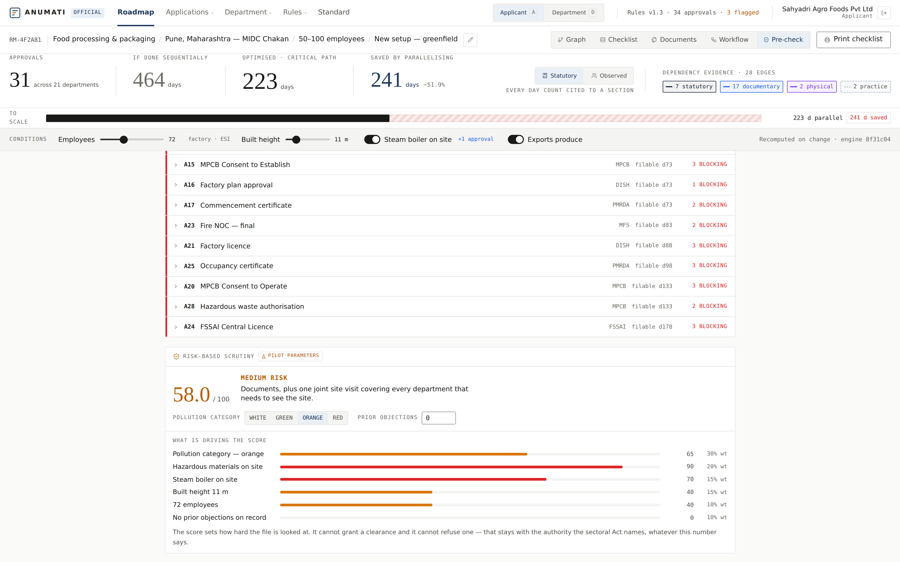
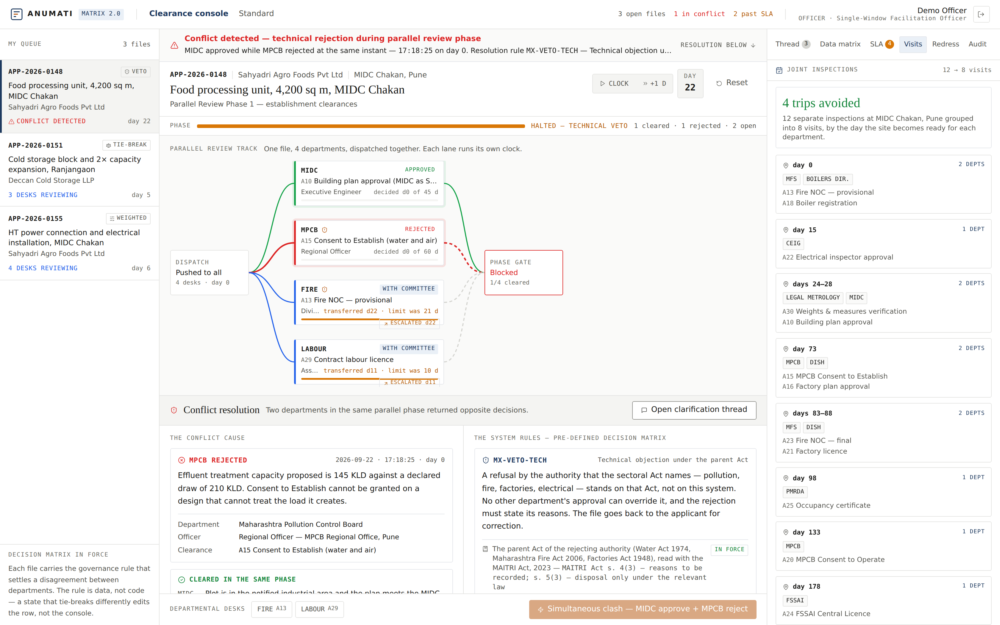
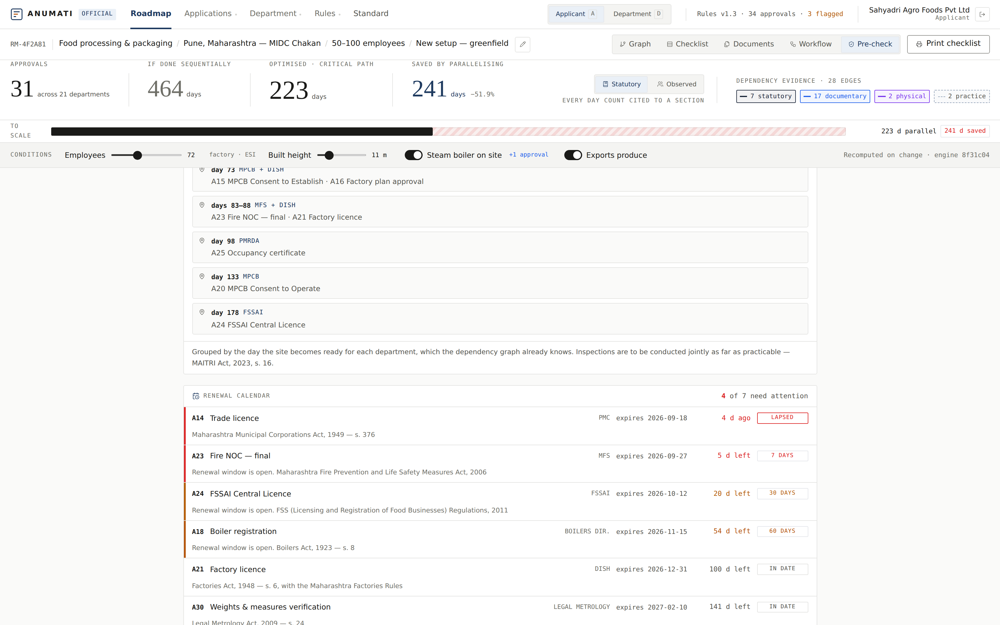
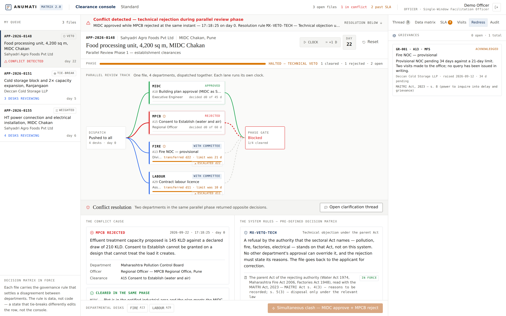

# ANUMATI (अनुमति)
### Smart Regulatory Clearance & Dynamic Approval Graph Engine
**Smart India Hackathon 2026 · Problem Statement ID: SIH26130 · Category: Software**

[](https://nextjs.org/)
[](https://www.typescriptlang.org/)
[](https://tailwindcss.com/)
[](https://reactflow.dev/)
[](https://github.com/pmndrs/zustand)
[]()
[]()

> **"Transforming sequential, opaque business licensing into deterministic, parallelized dependency roadmaps backed by verified statutory citations."**

---

## Executive Summary

Setting up an industrial enterprise in Maharashtra typically requires navigating **25 to 35+ clearances across 15+ central, state and local departments**. The state already has a serious single window: **MAITRI 2.0**, launched in February 2025 under the **Maharashtra Industry, Trade and Investment Facilitation Act, 2023**, carries 119 services across 15–16 departments with an application wizard, desk-level tracking, an incentive calculator, a document repository, a grievance system and NSWS synchronisation.

What no portal yet does — MAITRI included — is tell an applicant **when** each clearance may be filed, **check a file before it is filed**, **coordinate the departments that must decide together**, and **settle it when two of them decide the opposite thing**. That is the gap ANUMATI fills.

**One line:** MAITRI 2.0 tells you *what* to file. ANUMATI tells you *when*, checks it *before* you file, groups the inspections it will attract, and shows the Empowered Committee *where* files get stuck.

Entrepreneurs and Single-Window Facilitation Officers face three fundamental roadblocks:
1. **Opaque Dependency Order**: Department websites specify *what* documents they need, but never *when* an applicant can safely apply without waiting on another counter.
2. **False Sequential Delays**: Approvals that could legally be processed concurrently are submitted sequentially, inflating setup timelines from **255 days to 524+ days**.
3. **Redundant Document Submissions**: Applicants are repeatedly forced to physically carry government-issued certificates from one counter to another ("the state asking for its own paper").

**ANUMATI** solves this by modeling industrial clearances as a **directed acyclic graph (DAG)**. It computes the **Critical Path (CPM)**, discovers parallel approval tracks, flags departmental conventions vs statutory mandates, and provides an end-to-end operational roadmap for both **Entrepreneurs** and **Single-Window Facilitation Officers**.

---

## Application Walkthrough & Visual Highlights

### 1. Dynamic 4-Factor Setup Wizard
Customizes the regulatory requirement based on **Sector, Location, Scale, Stage**, and conditional project parameters (e.g. Steam Boilers, Hazardous Materials, Built Height, Export orientation).


---

### 2. Applicant View: Approval Dependency Graph & Critical Path Spine
An interactive visual canvas mapping all required clearances. 
- **Horizontal Axis = Parallel Lanes**: Approvals that can run at the same time.
- **Vertical Axis = Sequential Milestones**: Time progression from Day 0.
- **Red Critical Path Spine**: The non-negotiable sequence that governs overall project completion.
- **Timeline Collapse**: sequential filing compressed onto the critical path. The figure depends on where the land is, because a site inside a notified MIDC area needs no land-use conversion order and MIDC itself sanctions the building plan:

| Site | Critical path | Filed in series |
|---|---|---|
| **MIDC plot** (notified industrial area) | **223 days** | 464 days · 31 approvals |
| **Private land** (outside MIDC) | **255 days** | 524 days · 32 approvals |

> **Modelled, not measured.** These are the sum of notified time limits in series against the critical path through them. They are what the law allows, not what applicants experienced — the observed clock is a separate number, computed from field reports, and is labelled as seeded pilot data wherever it appears.


---

### 3. Department View: Statutory Register & Pre-Establishment / Pre-Operation Checklist
The facilitation officer's working ledger. Organised by standard industrial phases (**Pre-Establishment** and **Pre-Operation**), complete with legal citations, filing windows, statutory SLAs, and RTS deemed approval periods. Features one-click **Printable A4 Audit Sheet** generation for district offices.


---

### 4. What-If Policy Reform Simulator
An evidence-based decision workspace for Industries Department leadership. Policy makers toggle reform levers — shortening a notified time limit, removing a dependency that rests on practice rather than law, honouring a deeming clause the parent Act already contains — and see the macro impact on clearance timelines. Includes **strict statutory guardrails** that refuse a reform the statute does not permit. The Nodal Agency is already asked to propose reforms from user feedback (MAITRI Act s. 15); this is the instrument for that job.


---

### 5. Open Approval Graph Standard (OAGS)
A unified, open JSON schema and specification defining regulatory approvals, inter-departmental dependencies, evidence classifications, and confidence scoring. Designed so any state government or municipal authority can publish their regulatory rules in an interoperable format.


---

### 6. Document Re-verification Ledger
An automated audit measuring the administrative burden across government counters. Highlights cases where one department demands an official certificate already issued by another department within the same roadmap, enabling targeted DigiLocker / API integrations.


---

### 7. Sign-in: Officer and Applicant are now two separate products
The console is reached through a real sign-in. `OFFICER` / `ADMIN` opens the Matrix 2.0 clearance console; **Continue as an applicant** (or `APPLICANT` / `DEMO`) opens the roadmap. The gate is enforced both ways — an officer who opens the applicant roadmap is redirected to their console, so the approval catalogue, the sequential-vs-parallel arithmetic and the reform simulator never appear on the screen of the person actually processing the file.


---

### 8. Matrix 2.0: Concurrent Dispatch to Every Stakeholder Department
One file is pushed to all stakeholder departments at the same moment rather than passed down a chain. The track fans out from a single dispatch node into one lane per department, each running its own SLA clock from day 0, and re-converges at a phase gate.


---

### 9. Conflict Resolution Protocol — when two departments decide the opposite thing
When MIDC clears the building plan at the same instant MPCB refuses the Consent to Establish, the pipeline splits visually (green lane / red lane), a high-visibility banner drops across the file naming both departments and the clock second of the clash, the phase bar turns amber, and **Finalise approval** is disabled. The Conflict Resolution screen opens as a side-by-side grid: the exact refusal on the left — *"effluent treatment capacity proposed is 145 KLD against a declared draw of 210 KLD"* — and the row of the **Pre-Defined Decision Matrix** that settles it, with the Act it stands on, on the right.


Three governance rules ship, and the UI adapts to whichever one the file carries. Every rule declares whether its instrument is **in force** or **drafted for the pilot and not yet notified**, and the screen says which — a drafted clause must never borrow the authority of a real one:

| Rule | Behaviour on a clash | Resolution path |
|---|---|---|
| **Veto / hard block** (`MX-VETO-TECH`) | Stage halts, master action disabled | **Send for revision** — packages the objections *and* the clearances already granted, so nothing already passed is re-filed |
| **Escalation to tie-breaker** (`MX-ESCALATE-EQUAL`) | Equal weight, neither may override | The file routes **itself** — a temporary **Tie-Breaker Panel** node appears on the track and it lands on the steering committee's dashboard |
| **Risk-based scrutiny** (`MX-RISK-SCRUTINY`) | Departments score the risk rather than vote | Live consolidated score sets the **depth of scrutiny** — documents only, or a full joint inspection. Marked `DRAFT`: the Act permits risk-led inspection (s. 16) but sets no formula |

---

### 10. Tie-Breaker Panel — the senior officer's screen
Both departments' conflicting inputs side by side, with officer, designation, timestamp, weight and veto standing — and exactly two buttons: **Overrule & approve** or **Sustain rejection**. There is no third option on purpose; an escalation that can be left half-decided is how a file spends six months on a desk.


---

### 11. Weighted Consolidated Score
MSEDCL scores the distribution side 88; the Electrical Inspector scores 42, because the single-line diagram shows a 1,600 kVA transformer against a load application for 1,250 kVA. The consolidated score is live, with the threshold marked on the bar and every department's contribution broken out. It sets how hard the file is looked at — **never** whether the clearance is granted.


Once the last department reports, the phase settles itself — the file is marked failed and the project manager is notified, with the consolidated arithmetic shown beside the decision.


---

### 12. SLA Auto-Escalation and Deemed Approval
Every lane runs its own notified limit. Two days out, the desk is warned. On breach, **which consequence applies is a property of the statute, not of the department**:

- Where the parent Act carries its own deeming clause — MRTP s. 45(5), CGST r. 9(5), Water Act s. 25(7), Factories Act s. 6(2) — silence **deems the clearance granted** on that Act's terms.
- Everywhere else the Nodal Agency **transfers the file to the Empowered Committee** and the competent authority *ceases to have the power to deal with it* — MAITRI Act, 2023 s. 5(1) and s. 5(2). The lane stays open, because the Committee still has to decide it **under the same law** (s. 5(3)).

So one silent desk cannot hold a project — and nothing is waved through either.


---

### 13. Shared Data Matrix — the state stops asking for its own paper
Where a department needs a fact another ministry already holds — a land record, a tax standing, an antecedents check — the matrix fetches it instead of asking the applicant to carry a certificate across town. **Background validation runs itself the moment a file is dispatched**, so every record is on screen before an officer asks for it. Each names its source, its endpoint, and what it replaces. One record deliberately returns a **mismatch**, and the conflict screen then quotes it as the evidence behind the technical rejection.


> **Full explanation of the protocol, the state machine and a four-minute demo script: [`docs/MATRIX_2.0.md`](docs/MATRIX_2.0.md).**

---

### 14. Pre-submission check — the file is examined before it is filed
Every gap an officer would find at the counter, found in advance and for nothing: a document the department's own list asks for and the dossier does not hold, a prior order that does not exist yet, and — the expensive one — **the same physical fact written two different ways on two departments' forms**. Water draw declared as 210 KLD to MIDC and 145 KLD to MPCB is the exact clash the officer console then has to resolve three weeks later.

Statutory prerequisites block. Practice conventions only advise, because the rule base already knows the difference.



---

### 15. Risk-based scrutiny — how hard this file gets looked at
Departments score the risk a proposal carries instead of voting it up or down. Low risk clears on documents alone; high risk earns a full joint inspection. The weights are the district's own and are labelled a pilot parameter, because the Act permits risk-led and random inspection (s. 16) without setting a formula.

**The score decides scrutiny, never the clearance.** No number here can grant or refuse what a sectoral Act requires.



---

### 16. Joint inspection planner — one site, one visit
The Act asks for inspections to be conducted jointly as far as practicable (s. 16). The reason it rarely happens is not unwillingness — no single desk knows when every department will be ready to travel. The dependency graph does: an approval's window opens on the day the site is ready for that department. Grouping those days turns **12 separate inspections into 8 visits**.



---

### 17. Renewal calendar — a clearance is not a finish line
The day a licence expires the unit is operating unlawfully with nobody having done anything wrong. Every validity period is a published fact of the parent rules, so the calendar is simply the second half of the same rule base: expiry, renewal window, days left, and alarms at 60, 30 and 7 days.



---

### 18. Grievance — the one remedy that leaves the department
The Empowered Committee may call for the reasons behind a delay or a rejection and inquire into a grievance raised by an applicant (s. 8). One button on any stuck approval routes the file to that Committee — not back to the desk that is holding it. It decides nothing by itself: the application is still disposed of under the relevant law.



---

## Every feature maps to a section of the state's own Act

ANUMATI does not ask Maharashtra to legislate anything new. The MAITRI Act, 2023 already provides the machinery; this is the software that uses it.

| ANUMATI feature | MAITRI Act, 2023 |
|---|---|
| Dependency roadmap and sequencing | s. 20 — Online Wizard Module |
| Concurrent dispatch to every department | s. 4 — application through the Nodal Agency |
| Missed time limit transfers the file | s. 5 — Competent Authority ceases to have power |
| Tie-breaker decisions bind both sides | s. 6, s. 9 — Empowered Committee and binding effect |
| Joint inspection planner | s. 16 — inspections conducted jointly, random selection |
| Grievance button | s. 8 — power to call for reasons and inquire |
| Reform simulator and field reports | s. 15 — reforms proposed from user feedback |
| Delay analytics | s. 8 — review of applications pending beyond the limit |
| Adoption without amending any other state law | s. 25 — overriding effect |

**The one thing the console will never do:** grant a clearance an Act would have refused. Even the Empowered Committee disposes of a transferred application *under the relevant law* (s. 5(3)), and the code follows that — a transferred lane stays open until it is actually decided.

---

## Questions a jury will ask, and the answers

| Question | Answer |
|---|---|
| "MAITRI 2.0 already does this" | Yes — for the service list, tracking, incentives and grievance intake. No for **order**, **pre-submission checking**, **joint inspection planning** and **conflict handling**. We add only those four, on top of MAITRI rather than beside it. |
| "Where does 255 days come from?" | The sum of notified time limits in series against the critical path through them. **Modelled, not measured.** The observed clock is a separate number, computed from field reports, and labelled as seeded pilot data. |
| "Who verified these rules?" | We did, from the bare acts — every row names its Act and section, and the screen says `read from the bare act, officer review pending`. 11 of 34 are read; the other 23 are marked unverified rather than hidden. The review queue exists for exactly that gap. |
| "Can your system overrule MPCB?" | No. Even the Empowered Committee disposes of a transferred application **under the relevant law** — MAITRI Act s. 5(3). The console routes; it never decides a clearance. |
| "What if a law changes?" | Rules are versioned with effective dates. A roadmap generated today resolves against the rules as they stood today. |
| "Why would MAITRI adopt this?" | s. 15 already asks the Nodal Agency to propose reforms from user feedback. This is the instrument for that job — the reform simulator runs on the rule graph and refuses reforms the statute does not permit. |
| "Is the decision matrix your invention?" | Two of the three rows are drawn from enacted provisions and are marked `IN FORCE`. The third is a pilot parameter and is marked `DRAFT — NOT NOTIFIED` on every screen that shows it. |

---

## Tests

```bash
npm test          # 96 tests across the rule base, the matrix engine, compliance and the OAGS validator
npm run typecheck # strict TypeScript, no errors
npm run build     # production bundle
```

The suite is written against the pure engines, which is where the claims live. Some of
it exists to stop specific errors coming back:

- no deeming clause may be attributed to the Right to Public Services Act;
- no approval may claim a deeming clause without naming the provision that grants it;
- no invented individual may appear as a verifier;
- the two hero numbers (223 / 464 and 255 / 524) are **locked**, so a silent drift in
  the rule base breaks a test rather than quietly making a public claim untrue;
- **our own published rule base must pass our own validator.** If we publish a standard
  and our file fails it, nothing else in the suite matters.

---

## API

Five route handlers, live in the app. No key, CORS open, nothing stored — the rule base
is published under CC BY 4.0 and the validator holds nothing it is given.

| Method | Path | What it returns |
|---|---|---|
| `GET` | `/api/v1/standard/schema` | The OAGS JSON Schema, draft 2020-12 |
| `GET` | `/api/v1/standard/export` | Our Maharashtra rule base in OAGS. `?as_of=YYYY-MM-DD` for a past date |
| `POST` | `/api/v1/standard/validate` | Validates a posted OAGS document |
| `GET` | `/api/v1/approvals` | The rule base. `?as_of=`, `?stage=`, `?department=` |
| `POST` | `/api/v1/roadmap` | Builds a roadmap. `{ conditions, clock: "statutory" \| "observed" }` |

```bash
# Our own file, through our own validator
curl -s localhost:3000/api/v1/standard/export \
  | curl -s -X POST -H 'content-type: application/json' --data-binary @- \
      localhost:3000/api/v1/standard/validate

# 31 approvals, 223 days on the critical path against 464 filed in series
curl -s -X POST -H 'content-type: application/json' \
  -d '{"conditions":{"midc_land":true,"boiler":true,"factory":true}}' \
  localhost:3000/api/v1/roadmap
```

The validator runs the four checks the `/standard` page names — schema conformance,
citation on every rule, no cycles, no orphans. An invalid document still returns `200`:
the caller asked whether it validates, and "no, here is why" answers that question. A
warning is a remark and does not fail a file; an error does.

---

## Key Innovations & Core Architecture

### 1. Four-Tier Typed Dependency Evidence Matrix
Rather than treating all dependencies equally, ANUMATI classifies every edge connecting two approvals into four distinct categories with explicit confidence scores:

| Icon | Edge Type | Statutory Source | Confidence | Description |
|:---:|:---|:---|:---:|:---|
| 🔒 | **Statutory** | Written in Act / Rules | **1.00** | Legally binding prerequisite (e.g., Building Plan Approval requires NA Order under MLRC 1966 s. 44). |
| 📄 | **Documentary** | Departmental Form Requirement | **0.90** | Department B requires the certificate of Department A as an application attachment. |
| ⚙️ | **Physical** | Physical Reality | **1.00** | Physically impossible in reverse order (e.g., Factory inspection requires completed building structure). |
| 🤝 | **Practice** | Departmental Convention | **0.50** | Unwritten convention or bureaucratic custom. Flagged to the applicant and reformable by policy makers. |

### 2. Dual-Persona Architecture — two products behind one sign-in
- **Applicant Persona (Beneficiary)**: The execution roadmap — the dependency graph, the critical path, the document ledger, upcoming requirements and immediate next steps.
- **Officer Persona (DIC / MAITRI Facilitation Officer)**: The Matrix 2.0 clearance console — a queue of live files, concurrent departmental dispatch, SLA clocks with auto-escalation and deemed approval, the conflict resolution protocol, the shared data matrix, and a cited audit trail.

The two are gated by role in both directions, so the officer's screen carries no applicant-side material at all. See [`docs/MATRIX_2.0.md`](docs/MATRIX_2.0.md).

### 3. Pre-Defined Decision Matrix (Governance as Data)
Parallel dispatch removes the one useful property of sequential filing: that a file is only ever on one desk, and so can never be approved and rejected at once. The tie-break that replaces it is stored as **cited data rows**, not as branches in the console — `veto`, `escalation` and `weighted`, each carrying the Rule, GR or Policy clause it is drawn from. A state that tie-breaks differently edits a row; it does not edit the product.

### 4. Mathematical Optimization (CPM)
- Implements standard **Critical Path Method (CPM)** algorithms to compute earliest start, earliest finish, slack/float times, and the critical spine.
- Real-time reactivity: Adjusting employee headcount, building height, or operational conditions dynamically recalculates the graph in milliseconds.

---

## Strategic Implementation Plan

Our vision is to transform ANUMATI from an award-winning prototype into an institutional public digital infrastructure powering single-window facilitation nationwide.

```
┌─────────────────────────────────────────────────────────────────────────────┐
│                       ANUMATI STRATEGIC ROADMAP                             │
├─────────────────┬──────────────────┬──────────────────┬─────────────────────┤
│    PHASE 1      │     PHASE 2      │     PHASE 3      │      PHASE 4        │
│ Standalone MVP  │ Backend Engine   │ Ingestion &      │ State Integration   │
│ & Seeded Rules  │ & Versioning DB  │ Review Pipeline  │ & National Rollout  │
│   (COMPLETED)   │   (Month 1-2)    │   (Month 3-5)    │    (Month 6-12)     │
└─────────────────┴──────────────────┴──────────────────┴─────────────────────┘
```

### Phase 1: Standalone MVP & Seeded Regulatory Rules (Completed)
- Full Next.js 14 frontend with client-side reactive graph engine.
- Verified seed rule base for Maharashtra industrial manufacturing & food processing (34 approvals, 27 cited Acts & Government Resolutions).
- Interactive DAG visualization with custom React Flow nodes and typed edges.
- Policy Reform Simulator with statutory guardrails.
- Document Re-verification audit ledger.
- OAGS (Open Approval Graph Standard) specification v0.1.
- **Matrix 2.0 officer console**: role sign-in, concurrent departmental dispatch, the conflict resolution protocol across all three governance rules, SLA auto-escalation and deemed approval, the shared data matrix, cross-departmental clarification threads, and a cited audit trail.

### Phase 2: Production Backend & Bitemporal Database (Month 1 - 2)
- **FastAPI Microservice**: High-throughput REST API serving roadmap generation requests via NetworkX graph compute.
- **PostgreSQL 16 Relational Engine**: Normalized schema for approvals, rules, citations, and applications.
- **Bitemporal Rule Versioning**: Every regulatory change is recorded with valid-time and system-time (`effective_from`, `effective_to`). A roadmap generated today remains reproducible even if laws change years later.
- **Automated Type Generation**: OpenAPI contract synchronizing Pydantic models directly to TypeScript interfaces.

### Phase 3: Automated Ingestion & Human-in-the-Loop Review (Month 3 - 5)
- **Gazette & Form Extraction Pipeline**: Automated crawler monitoring government gazette notifications and single-window departmental forms.
- **Structured Knowledge Extraction**: High-precision parser extracting statutory SLAs, deemed approval clauses, and required attachments into standardized approval drafts.
- **Department Review Queue**: Strict human verification interface. **No rule or dependency edge is auto-published without an officer's sign-off and explicit statutory section citation.**

### Phase 4: Pilot Deployment & Single-Window Integration (Month 6 - 8)
- **District Pilot**: Field testing with the District Industries Centre (DIC) Pune and Maharashtra Industrial Development Corporation (MIDC) Chakan facilitation cell.
- **MAITRI / NSWS Connector**: API integration enabling applicants to jump directly from their ANUMATI roadmap into the corresponding form on the state or national single-window portal.
- **DigiLocker Integration**: Verification of pre-existing documents directly from DigiLocker, eliminating redundant uploads for 15+ recurring documents.

### Phase 5: Multi-State Expansion & Empirical Feedback Moat (Month 9 - 12+)
- **Multi-State Scaling**: Expanding rule sets to high-growth industrial states (Tamil Nadu, Gujarat, Karnataka, Uttar Pradesh, Telangana).
- **Closed-Loop Delay Reporting**: When an applicant experiences an objection or rejection at a counter, they can log it with one click. This feeds empirical rejection frequency data back into the engine, creating a defensible data moat for ease-of-doing-business governance.

---

## Technology Stack

| Layer | Technologies Used |
|---|---|
| **Frontend Framework** | Next.js 14 (App Router, React 18, Server & Client Components) |
| **Language & Typing** | TypeScript 5.7 (Strict type-checking) |
| **Styling & Design** | Tailwind CSS 3.4, Custom Design Tokens, CSS Variables |
| **Graph Visualization** | @xyflow/react (React Flow v12) |
| **State Management** | Zustand v5 (Reactive client store) |
| **Analytics & Charts** | Recharts, Tabular Metrics |
| **Icons & UI Primitives** | Lucide React |
| **Backend (Target Architecture)** | FastAPI (Python 3.11), Pydantic v2, NetworkX |
| **Database & Versioning** | PostgreSQL 16, SQLAlchemy 2.0, Alembic |
| **Schema Standard** | OAGS (Open Approval Graph Schema v0.1) |

---

## Quickstart & Local Setup

The repository is configured to run out-of-the-box using the embedded regulatory rule base in `lib/data/`. No external database or Python server is required for frontend evaluation.

### Prerequisites
- **Node.js**: v18.17.0 or higher (Tested on Node v24.16.0)
- **npm**: v9.0.0 or higher

### Installation

1. **Clone the Repository:**
   ```bash
   git clone https://github.com/shubham54191/ANUMATI.git
   cd ANUMATI/anumati-web
   ```

2. **Install Dependencies:**
   ```bash
   npm install
   ```

3. **Start the Development Server:**
   ```bash
   npm run dev
   ```

4. **Access the Application:**
   Open your browser and navigate to:
   - **Local URL**: [http://localhost:3000](http://localhost:3000)
   - The application starts on port **3000** (or port **3001** if port 3000 is occupied).

5. **Sign in.** The application opens on the sign-in screen. Two demonstration accounts are seeded:

   | User id | Password | Opens |
   |---|---|---|
   | `OFFICER` | `ADMIN` | Matrix 2.0 clearance console — parallel dispatch, conflict resolution, SLA escalation, shared data matrix |
   | `APPLICANT` | `DEMO` | Applicant roadmap — dependency graph, critical path, document ledger |

   **Continue as an applicant** on the sign-in screen skips the credentials for the applicant side. Credentials are case-insensitive and trimmed.

### Running on a Specific Port
To run explicitly on Port 3001 or any alternate port:
```bash
npm run dev -- -p 3001
```

### Production Build & Verification
To verify type safety and produce an optimized production bundle:
```bash
npm run typecheck    # Runs TypeScript compiler check (0 errors)
npm run build        # Generates production bundle
npm run start        # Starts production server on http://localhost:3000
```

---

## Project Structure

```
ANUMATI/
├── README.md                      # Primary project documentation & architecture guide
├── screenshots/                   # High-resolution screenshots of key user interfaces
│   ├── 01-setup-wizard.png
│   ├── 02-applicant-roadmap-graph.png
│   ├── 03-officer-checklist-register.png
│   ├── 04-policy-reform-simulator.png
│   ├── 05-oags-standard-schema.png
│   ├── 06-document-reuse-ledger.png
│   └── 07-15 …                    # Matrix 2.0 console, conflict protocol, SLA, data matrix
├── docs/                          # Comprehensive technical architecture & presentation plans
│   ├── BACKEND_ARCHITECTURE.md
│   ├── FRONTEND_ARCHITECTURE.md
│   ├── MATRIX_2.0.md              # Conflict resolution protocol, demo script & internals
│   └── SIH_PRESENTATION_PLAN.md
└── anumati-web/                   # Next.js 14 web application
    ├── app/                       # App router pages & layouts
    │   ├── login/                 # Role sign-in (officer / applicant)
    │   ├── matrix/                # Matrix 2.0 officer clearance console
    │   ├── roadmap/new/           # 4-question setup wizard
    │   ├── roadmap/[roadmapId]/   # Graph view & Officer register
    │   ├── roadmap/[roadmapId]/simulate/ # Policy reform simulator
    │   └── standard/              # OAGS specification & schema viewer
    ├── components/                # Modular UI & graph components
    │   ├── auth/                  # Role gate — keeps each persona in its own product
    │   ├── graph/                 # React Flow custom nodes, batch lanes, edge renderers
    │   ├── matrix/                # Parallel track, conflict screen, tie-breaker, SLA board,
    │   │                          #   data matrix, clarification thread, audit trail
    │   ├── register/              # Officer checklist & statutory table
    │   ├── documents/             # Re-verification audit ledger
    │   ├── simulator/             # Reform levers, impact cards & guardrails
    │   └── ui/                    # Reusable design tokens, buttons, dialogs
    ├── lib/
    │   ├── data/                  # Seeded rule base (Maharashtra industrial regulations)
    │   ├── graph/                 # CPM critical path algorithms, layout calculations
    │   ├── matrix/                # Decision matrix rows, seeded files, conflict state machine
    │   └── constants/             # Sector definitions, locations, edge classifications
    ├── store/                     # Zustand stores — roadmap, matrix console, session
    └── types/                     # Clean TypeScript domain models & schemas
```

---

## Statutory Rules & Legal References Cited

All regulatory data in the seed is grounded in published Acts, Rules, and Notifications, including:
- **Maharashtra Land Revenue Code (MLRC) 1966**, Section 44 (Non-Agricultural Land-use Permission)
- **Companies Act 2013**, Section 7 (SPICe+ Incorporation)
- **Electricity Act 2003**, Section 43 (High Tension Power Sanction)
- **Maharashtra Fire Prevention & Life Safety Measures Act 2006**, Section 3 (Provisional Fire NOC)
- **Water (Prevention & Control of Pollution) Act 1974** & **Air Act 1981** (MPCB Consent to Establish)
- **Factories Act 1948**, Section 6 & **Maharashtra Factory Rules 1963** (Factory Plan Approval)
- **Food Safety and Standards Act 2006**, Section 31 (FSSAI Manufacturing Licence)
- **Maharashtra Industry, Trade and Investment Facilitation Act 2023** (Mah. Act XXXIV of 2023) — single window, Empowered Committee, transfer on delay, joint inspection
- **Maharashtra Right to Public Services Act 2015** (appeal under s. 9; penalty on the designated officer under s. 10 — *not* a deeming provision)

---

## Smart India Hackathon 2026 Team

- **Problem Statement**: SIH26130 · Inter-departmental Regulatory Approvals & Workflow Coordination
- **Solution Name**: ANUMATI (अनुमति)
- **GitHub Repository**: [https://github.com/shubham54191/ANUMATI](https://github.com/shubham54191/ANUMATI)

---
*Built with precision for Smart India Hackathon 2026.*
