# ANUMATI (अनुमति)
### Smart Regulatory Clearance & Dynamic Approval Graph Engine
**Smart India Hackathon 2026 · Problem Statement ID: SIH26130 · Category: Software**

[](https://nextjs.org/)
[](https://www.typescriptlang.org/)
[](https://fastify.dev/)
[](https://www.postgresql.org/)
[](https://www.python.org/)
[]()
[]()
[]()

> **"Transforming sequential, opaque business licensing into deterministic, parallelized dependency roadmaps backed by verified statutory citations."**

---

## Executive Summary

Setting up an industrial enterprise in Maharashtra typically requires navigating **25 to 35+ clearances across 15+ central, state and local departments**. The state already has a serious single window: **MAITRI 2.0**, launched in February 2025 under the **Maharashtra Industry, Trade and Investment Facilitation Act, 2023**, carries 119 services across 15–16 departments with an application wizard, desk-level tracking, an incentive calculator, a document repository, a grievance system and NSWS synchronisation.

What no portal yet does — MAITRI included — is tell an applicant **when** each clearance may be filed, **check a file before it is filed**, **coordinate the departments that must decide together**, and **settle it when two of them decide the opposite thing**. That is the gap ANUMATI fills.

**One line:** MAITRI 2.0 tells you *what* to file. ANUMATI tells you *when*, checks it *before* you file, groups the inspections it will attract, and shows the Empowered Committee *where* files get stuck.

Entrepreneurs and Single-Window Facilitation Officers face three fundamental roadblocks:
1. **Opaque Dependency Order**: Department websites specify *what* documents they need, but never *when* an applicant can safely apply without waiting on another counter.
2. **False Sequential Delays**: Approvals that could legally be processed concurrently are submitted sequentially, inflating setup timelines from **255 days to 524+ days**.
3. **Redundant Document Submissions**: Applicants are repeatedly forced to physically carry government-issued certificates from one counter to another ("the state asking for its own paper").

**ANUMATI** solves this by modeling industrial clearances as a **directed acyclic graph (DAG)**. It computes the **Critical Path (CPM)**, discovers parallel approval tracks, flags departmental conventions vs statutory mandates, and provides an end-to-end operational roadmap for both **Entrepreneurs** and **Single-Window Facilitation Officers**.

---

## What is in this repository

Three parts. The web app runs on its own; the other two are what turns the walkthrough into a deployment.

| Directory | What it is | Runs on |
|---|---|---|
| [`anumati-web/`](anumati-web) | The product. Applicant roadmap, officer clearance console, the rule engine, the OAGS API. Runs standalone against the seeded rule base — no database needed. | Next.js 14 · TypeScript · React 18 |
| [`anumati-server/`](anumati-server) | The API and worker. Accounts, files, decisions, clocks, the append-only decision ledger. **Imports the same engine the browser runs**, so a roadmap or a conflict is computed identically on both sides — and the server's answer is the one that counts. | Fastify 5 · Node 22 · PostgreSQL 16 · pg-boss |
| [`anumati-extraction/`](anumati-extraction) | The offline pipeline that reads a gazette PDF and **drafts** rules. It never publishes: every draft lands in the review queue for a named officer to sign off or reject. | Python 3.11 · pdfplumber · a local model via Ollama |

**Two modes, and the screen always says which.** With `NEXT_PUBLIC_ANUMATI_API` unset the web app is an offline demo running entirely in the browser. Set it, and sign-in, files, decisions and the ledger move to the server. A badge in the chrome reads `DEMO · OFFLINE` or names the live server, because a walkthrough must never be mistaken for a deployment.

### How to read this document

| If you have | Read |
|---|---|
| 2 minutes | [Executive Summary](#executive-summary) and the [walkthrough](#application-walkthrough--visual-highlights) screenshots |
| 10 minutes | The walkthrough in full, then [Questions a jury will ask](#questions-a-jury-will-ask-and-the-answers) |
| You want to run it | [Quickstart](#quickstart--local-setup) — one command for the offline demo, one for the full stack |
| You want to check our work | [Tests](#tests), the [API](#api), and [Statutory references](#statutory-rules--legal-references-cited) |
| You are building on it | [Architecture](#complete-architecture-flow--system-mechanics) and [Project structure](#project-structure) |

---

## Application Walkthrough & Visual Highlights

Every screenshot below is taken from the running build, on the seeded Maharashtra rule base, in offline demo mode.

### 1. Dynamic 4-Factor Setup Wizard
Customizes the regulatory requirement based on **Sector, Location, Scale, Stage**, and conditional project parameters (e.g. Steam Boilers, Hazardous Materials, Built Height, Export orientation).

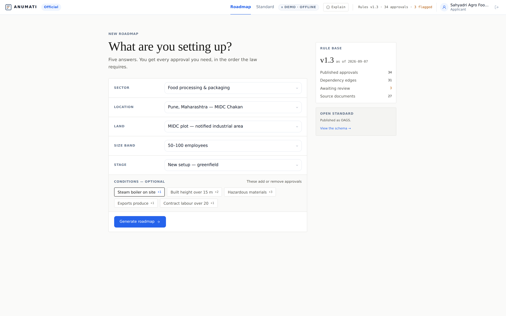

---

### 2. Applicant View: Approval Dependency Graph & Critical Path Spine
An interactive visual canvas mapping all required clearances. 
- **Horizontal Axis = Parallel Lanes**: Approvals that can run at the same time.
- **Vertical Axis = Sequential Milestones**: Time progression from Day 0.
- **Red Critical Path Spine**: The non-negotiable sequence that governs overall project completion.
- **Timeline Collapse**: sequential filing compressed onto the critical path. The figure depends on where the land is, because a site inside a notified MIDC area needs no land-use conversion order and MIDC itself sanctions the building plan:

| Site | Critical path | Filed in series |
|---|---|---|
| **MIDC plot** (notified industrial area) | **223 days** | 464 days · 31 approvals |
| **Private land** (outside MIDC) | **255 days** | 524 days · 32 approvals |

> **Modelled, not measured.** These are the sum of notified time limits in series against the critical path through them. They are what the law allows, not what applicants experienced — the observed clock is a separate number, computed from field reports, and is labelled as seeded pilot data wherever it appears.


The same roadmap as a calendar, for anyone who thinks in dates rather than in graphs:

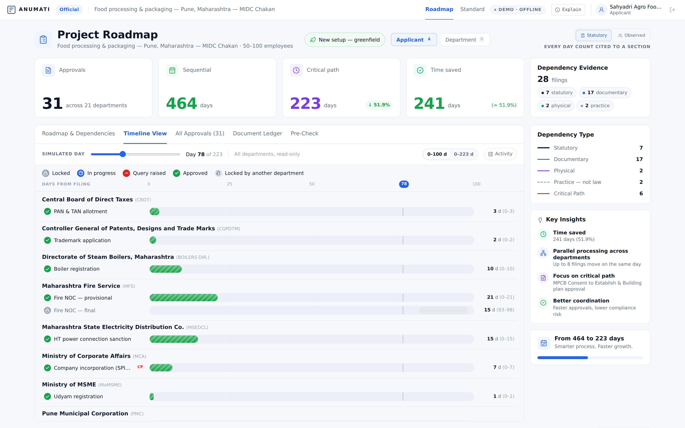

Open any approval and the evidence behind it opens with it — the Act and section, the days, what the approval consumes and what it produces, and how confident the rule base is:

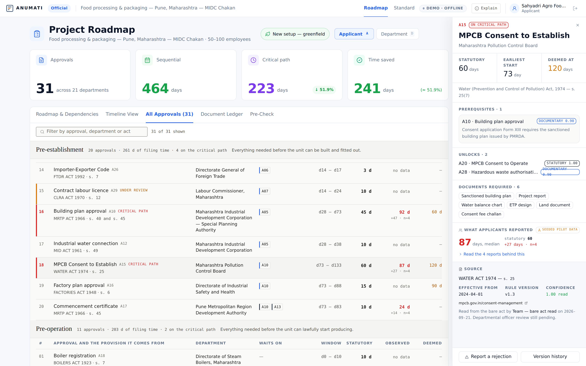

---

### 3. Department View: Statutory Register & Pre-Establishment / Pre-Operation Checklist
The facilitation officer's working ledger. Organised by standard industrial phases (**Pre-Establishment** and **Pre-Operation**), complete with legal citations, filing windows, statutory SLAs, and the deemed-approval clauses that actually exist in the parent Acts. The RTS Act 2015 is not one of them: it gives an appeal and a penalty on the officer, not a deemed approval, so an SLA breach here transfers the file to the Empowered Committee under MAITRI Act 2023 s. 5. Features one-click **Printable A4 Audit Sheet** generation for district offices.

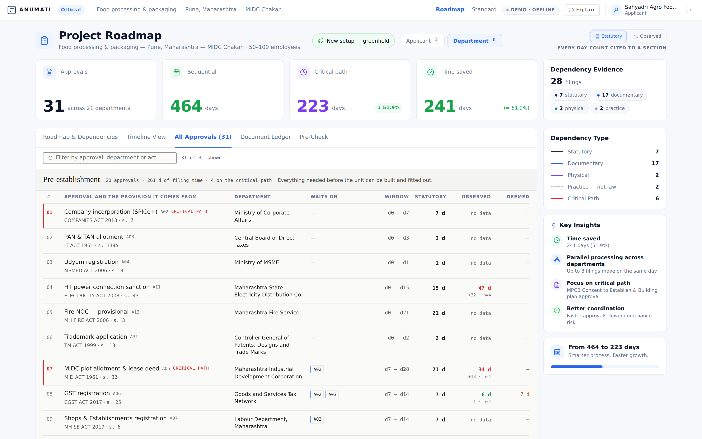

The same register on the observed clock, where the gap between what the law allows and what applicants reported is visible row by row:

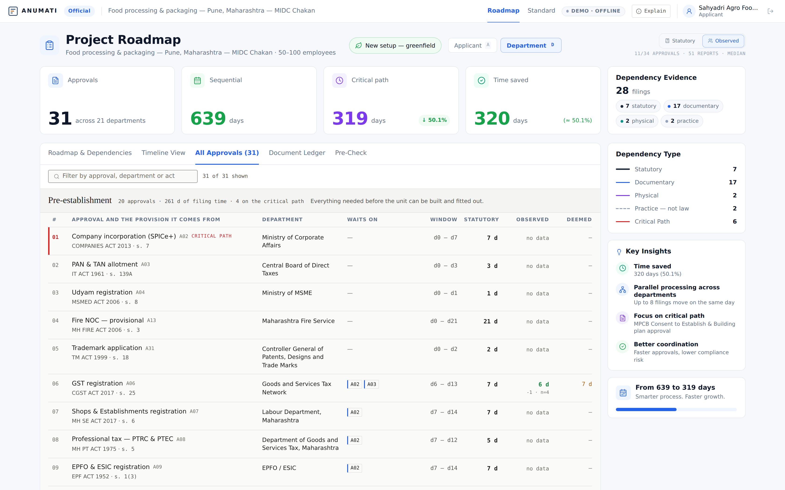

---

### 4. What-If Policy Reform Simulator
An evidence-based decision workspace for Industries Department leadership. Policy makers toggle reform levers — shortening a notified time limit, removing a dependency that rests on practice rather than law, honouring a deeming clause the parent Act already contains — and see the macro impact on clearance timelines. Includes **strict statutory guardrails** that refuse a reform the statute does not permit. The Nodal Agency is already asked to propose reforms from user feedback (MAITRI Act s. 15); this is the instrument for that job.

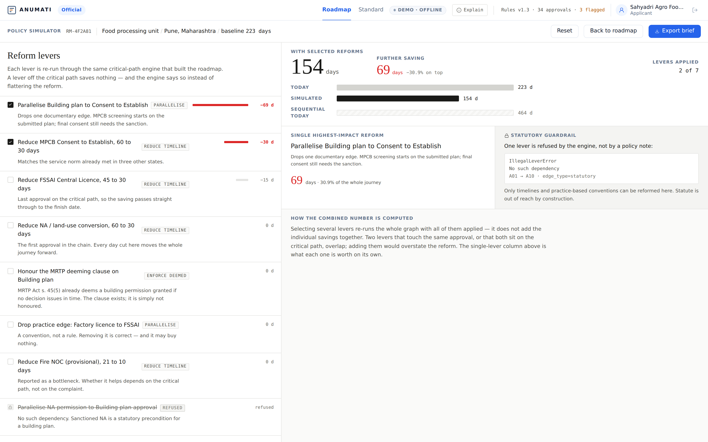

The evidence for a reform comes from the people who hit the counter. An applicant refused at a desk can report it in one click against the exact approval, and the report joins the field data the observed clock is computed from:

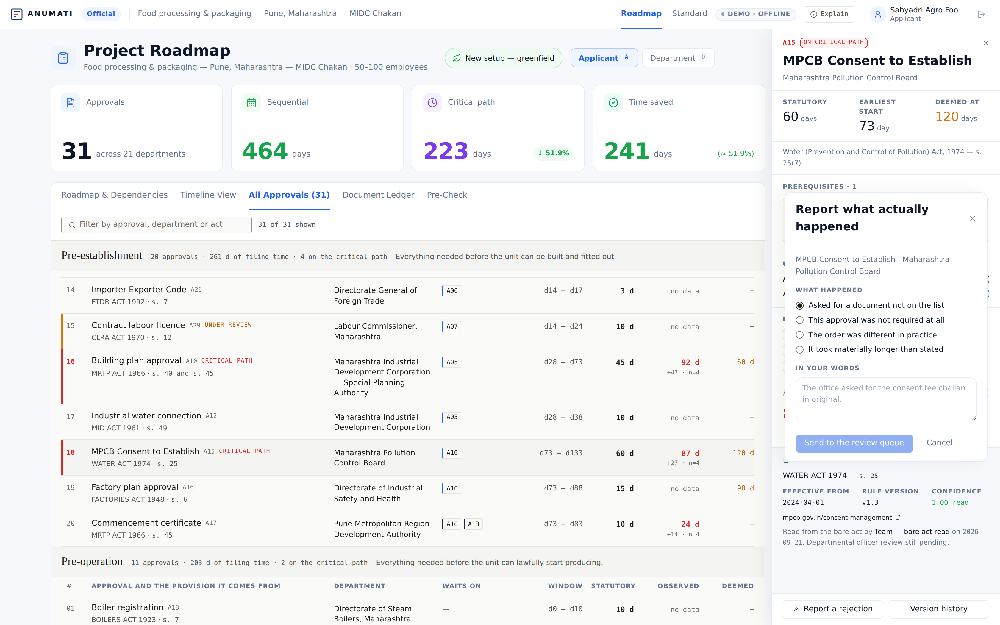

---

### 5. Open Approval Graph Standard (OAGS)
A unified, open JSON schema and specification defining regulatory approvals, inter-departmental dependencies, evidence classifications, and confidence scoring. Designed so any state government or municipal authority can publish their regulatory rules in an interoperable format.

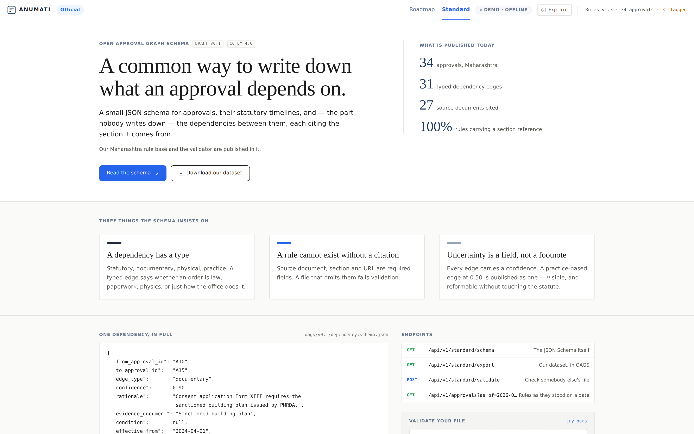

---

### 6. Document Re-verification Ledger
An automated audit measuring the administrative burden across government counters. Highlights cases where one department demands an official certificate already issued by another department within the same roadmap, enabling targeted DigiLocker / API integrations.

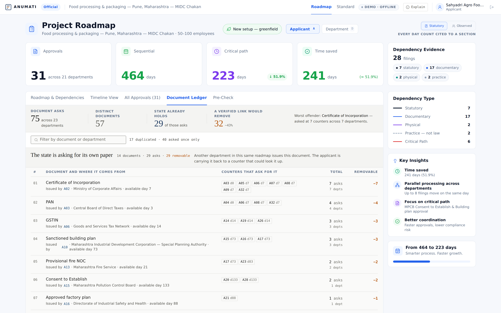

---

### 7. Sign-in: Officer and Applicant are now two separate products
The console is reached through a real sign-in. `OFFICER` / `ADMIN` opens the Matrix 2.0 clearance console; **Continue as an applicant** (or `APPLICANT` / `DEMO`) opens the roadmap. The gate is enforced both ways — an officer who opens the applicant roadmap is redirected to their console, so the approval catalogue, the sequential-vs-parallel arithmetic and the reform simulator never appear on the screen of the person actually processing the file.

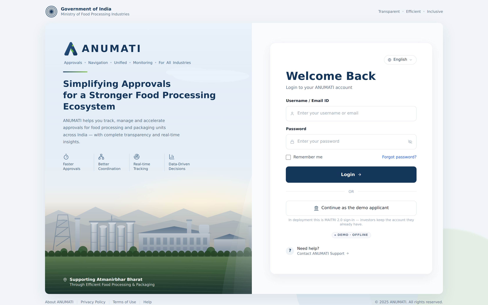

---

### 8. Matrix 2.0: Concurrent Dispatch to Every Stakeholder Department
One file is pushed to all stakeholder departments at the same moment rather than passed down a chain. The track fans out from a single dispatch node into one lane per department, each running its own SLA clock from day 0, and re-converges at a phase gate.

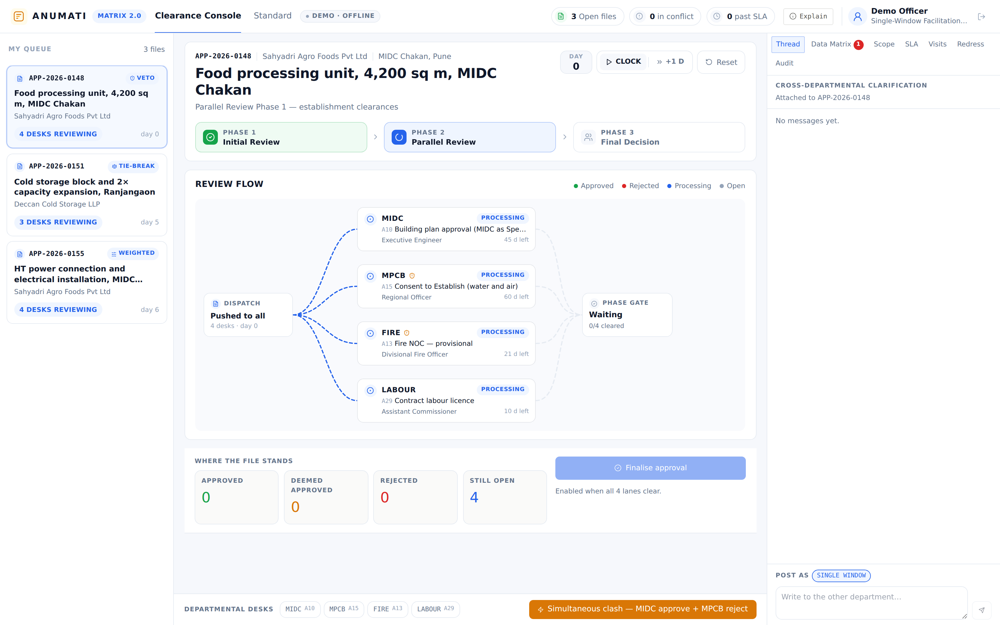

---

### 9. Conflict Resolution Protocol — when two departments decide the opposite thing
When MIDC clears the building plan at the same instant MPCB refuses the Consent to Establish, the pipeline splits visually (green lane / red lane), a high-visibility banner drops across the file naming both departments and the clock second of the clash, the phase bar turns amber, and **Finalise approval** is disabled. The Conflict Resolution screen opens as a side-by-side grid: the exact refusal on the left — *"effluent treatment capacity proposed is 145 KLD against a declared draw of 210 KLD"* — and the row of the **Pre-Defined Decision Matrix** that settles it, with the Act it stands on, on the right.

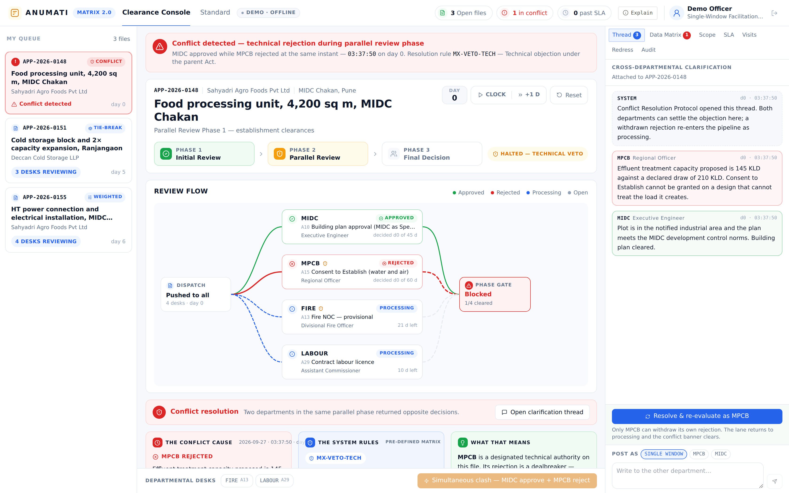

Where the rule that settles a file is a pilot parameter rather than a notified one, the screen says so on the rule itself. A drafted clause must never borrow the authority of a real one:


Three governance rules ship, and the UI adapts to whichever one the file carries. Every rule declares whether its instrument is **in force** or **drafted for the pilot and not yet notified**, and the screen says which — a drafted clause must never borrow the authority of a real one:

| Rule | Behaviour on a clash | Resolution path |
|---|---|---|
| **Veto / hard block** (`MX-VETO-TECH`) | Stage halts, master action disabled | **Send for revision** — packages the objections *and* the clearances already granted, so nothing already passed is re-filed |
| **Escalation to tie-breaker** (`MX-ESCALATE-EQUAL`) | Equal weight, neither may override | The file routes **itself** — a temporary **Tie-Breaker Panel** node appears on the track and it lands on the steering committee's dashboard |
| **Risk-based scrutiny** (`MX-RISK-SCRUTINY`) | Departments score the risk rather than vote | Live consolidated score sets the **depth of scrutiny** — documents only, or a full joint inspection. Marked `DRAFT`: the Act permits risk-led inspection (s. 16) but sets no formula |

---

### 10. Tie-Breaker Panel — the senior officer's screen
Both departments' conflicting inputs side by side, with officer, designation, timestamp, weight and veto standing — and exactly two buttons: **Overrule & approve** or **Sustain rejection**. There is no third option on purpose; an escalation that can be left half-decided is how a file spends six months on a desk.

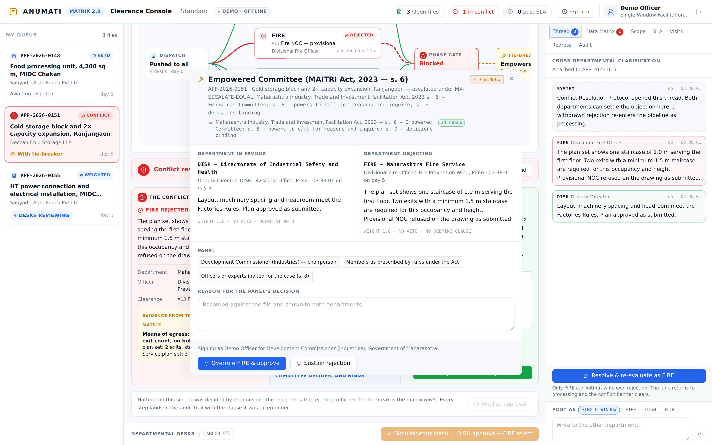

Routing a file to the panel is not a dialog that disappears. A tie-breaker node joins the track, so the file's own picture records that it went to the Committee and came back:

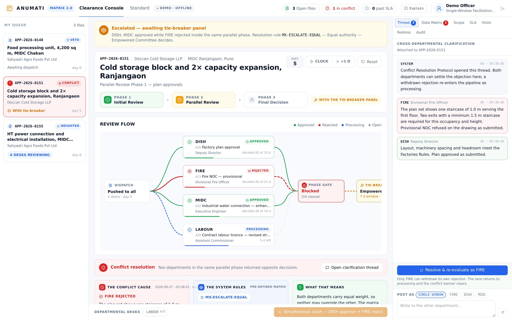

---

### 11. Weighted Consolidated Score
MSEDCL scores the distribution side 88; the Electrical Inspector scores 42, because the single-line diagram shows a 1,600 kVA transformer against a load application for 1,250 kVA. The consolidated score is live, with the threshold marked on the bar and every department's contribution broken out. It sets how hard the file is looked at — **never** whether the clearance is granted.

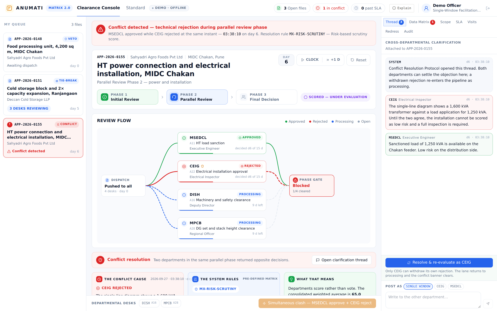

Once the last department reports, the phase settles itself — the file is marked failed and the project manager is notified, with the consolidated arithmetic shown beside the decision.

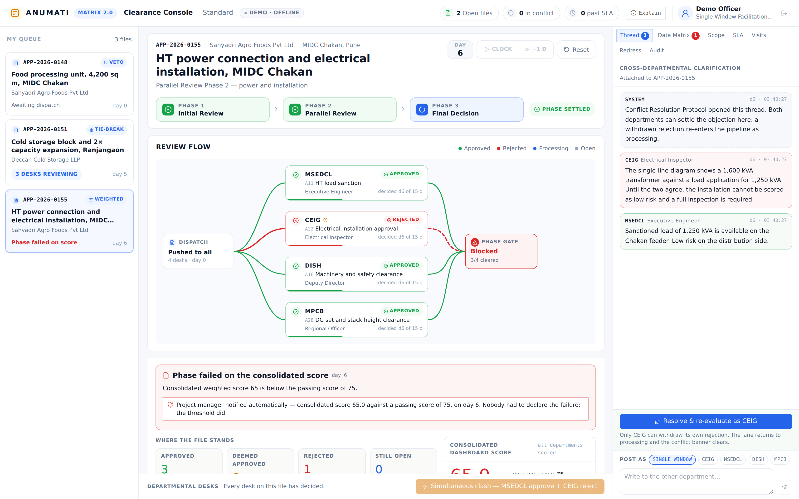

---

### 12. SLA Auto-Escalation and Deemed Approval
Every lane runs its own notified limit. Two days out, the desk is warned. On breach, **which consequence applies is a property of the statute, not of the department**:

- Where the parent Act carries its own deeming clause — MRTP s. 45(5), CGST r. 9(5), Water Act s. 25(7), Factories Act s. 6(2) — silence **deems the clearance granted** on that Act's terms.
- Everywhere else the Nodal Agency **transfers the file to the Empowered Committee** and the competent authority *ceases to have the power to deal with it* — MAITRI Act, 2023 s. 5(1) and s. 5(2). The lane stays open, because the Committee still has to decide it **under the same law** (s. 5(3)).

So one silent desk cannot hold a project — and nothing is waved through either.

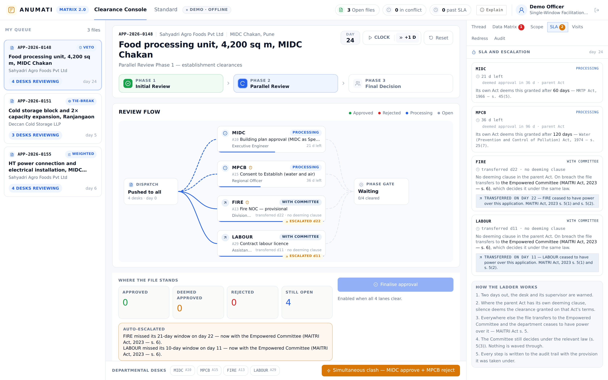

On the track, a transferred lane is drawn as transferred — still open, now the Committee's, with the day it moved and the provision it moved under:

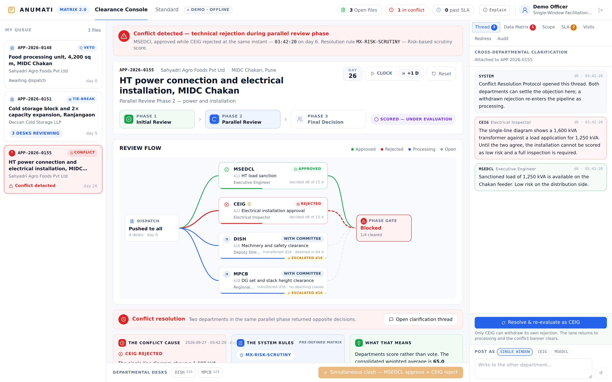

---

### 13. Shared Data Matrix — the state stops asking for its own paper
Where a department needs a fact another ministry already holds — a land record, a tax standing, an antecedents check — the matrix fetches it instead of asking the applicant to carry a certificate across town. **Background validation runs itself the moment a file is dispatched**, so every record is on screen before an officer asks for it. Each names its source, its endpoint, and what it replaces. One record deliberately returns a **mismatch**, and the conflict screen then quotes it as the evidence behind the technical rejection.

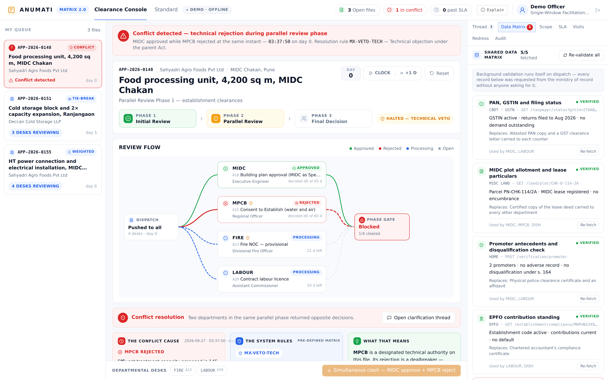

> **Full explanation of the protocol, the state machine and a four-minute demo script: [`docs/MATRIX_2.0.md`](docs/MATRIX_2.0.md).**

---

### 14. Pre-submission check — the file is examined before it is filed
Every gap an officer would find at the counter, found in advance and for nothing: a document the department's own list asks for and the dossier does not hold, a prior order that does not exist yet, and — the expensive one — **the same physical fact written two different ways on two departments' forms**. Water draw declared as 210 KLD to MIDC and 145 KLD to MPCB is the exact clash the officer console then has to resolve three weeks later.

Statutory prerequisites block. Practice conventions only advise, because the rule base already knows the difference.

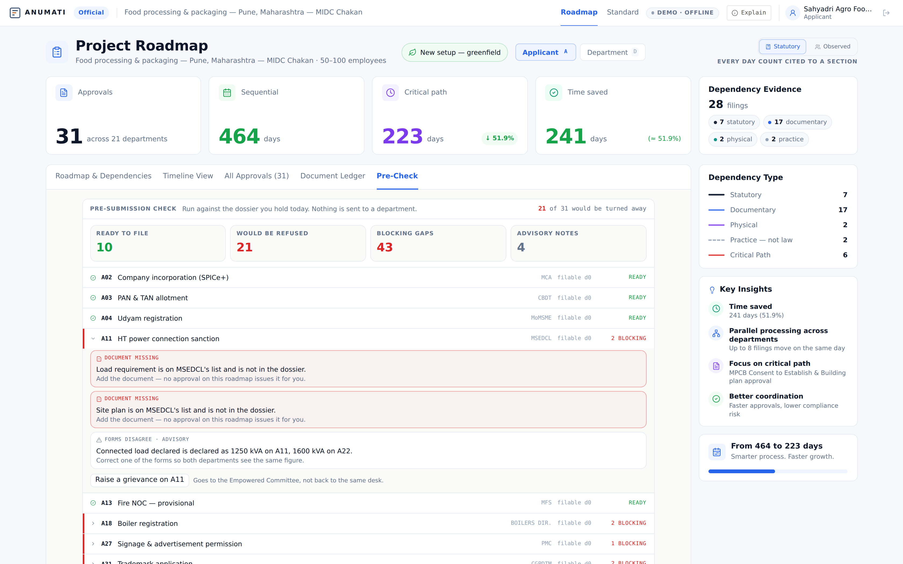

---

### 15. Risk-based scrutiny — how hard this file gets looked at
Departments score the risk a proposal carries instead of voting it up or down. Low risk clears on documents alone; high risk earns a full joint inspection. The weights are the district's own and are labelled a pilot parameter, because the Act permits risk-led and random inspection (s. 16) without setting a formula.

**The score decides scrutiny, never the clearance.** No number here can grant or refuse what a sectoral Act requires.

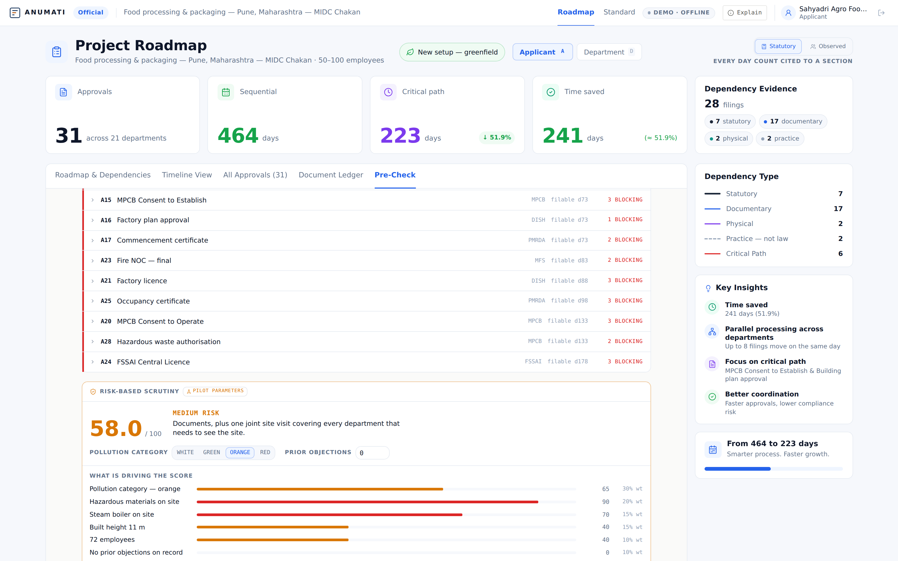

---

### 16. Joint inspection planner — one site, one visit
The Act asks for inspections to be conducted jointly as far as practicable (s. 16). The reason it rarely happens is not unwillingness — no single desk knows when every department will be ready to travel. The dependency graph does: an approval's window opens on the day the site is ready for that department. Grouping those days turns **12 separate inspections into 8 visits**.

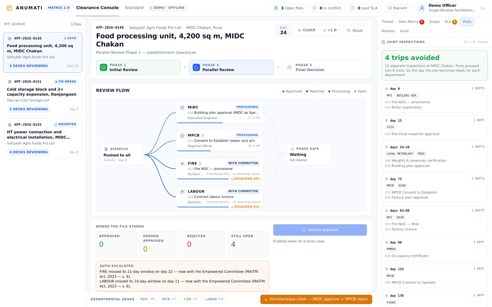

The applicant sees the same merge from the other side — how many separate visits the site would otherwise have taken:

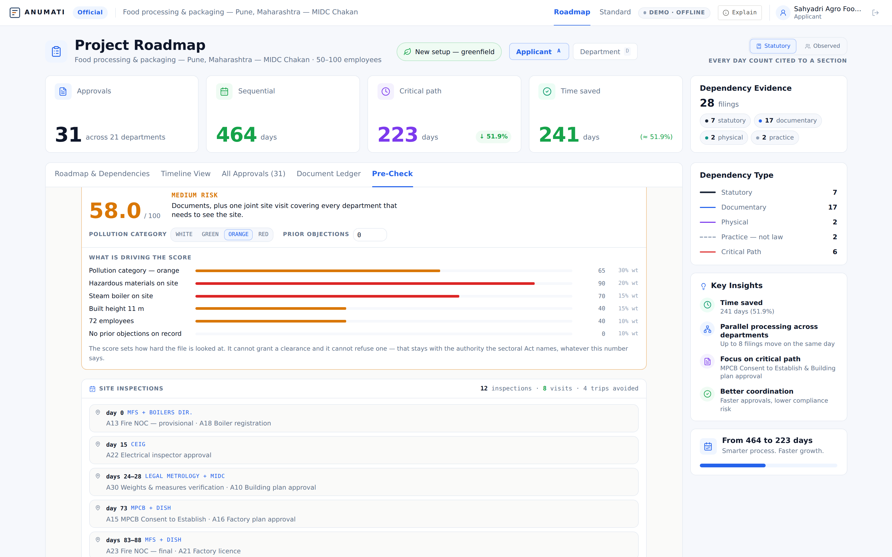

---

### 17. Renewal calendar — a clearance is not a finish line
The day a licence expires the unit is operating unlawfully with nobody having done anything wrong. Every validity period is a published fact of the parent rules, so the calendar is simply the second half of the same rule base: expiry, renewal window, days left, and alarms at 60, 30 and 7 days.

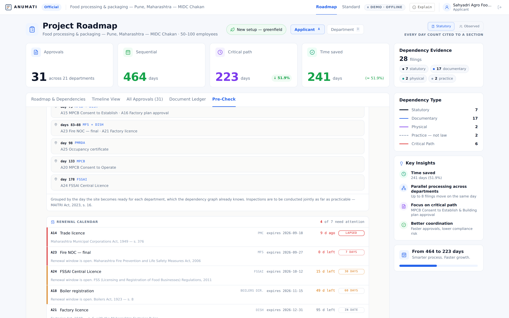

---

### 18. Grievance — the one remedy that leaves the department
The Empowered Committee may call for the reasons behind a delay or a rejection and inquire into a grievance raised by an applicant (s. 8). One button on any stuck approval routes the file to that Committee — not back to the desk that is holding it. It decides nothing by itself: the application is still disposed of under the relevant law.

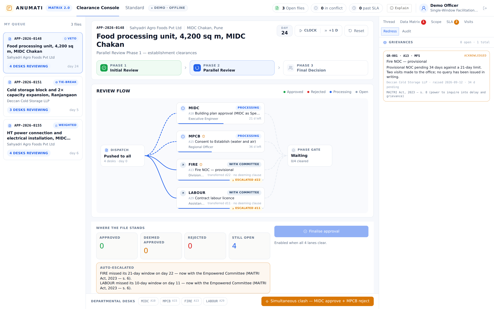

The button itself sits on the stuck approval, in the applicant's own pre-check, and names where the file goes before it is pressed:

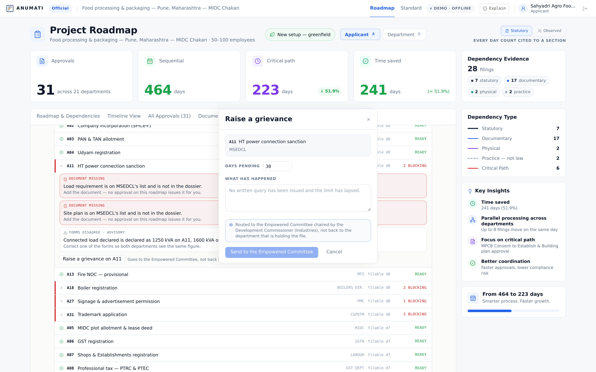

---

### 19. Parameter ownership — an upstream approval is context, never clearance
A department's approval covers only the parameters that department is competent to judge. Building's sign-off on a plan says nothing about effluent; the plan board's sign-off says nothing about staircase width. Each parameter group therefore carries its **owning department**, and the console reads the file from a chosen desk.

Reading `APP-2026-0148` as **MPCB**: the site parameters show cleared by MIDC and signed, the effluent parameters show **"Unverified — your review"**, and labour and fire show as another desk's work. A department can mark only the groups it owns, and doing so writes one audit event naming it.

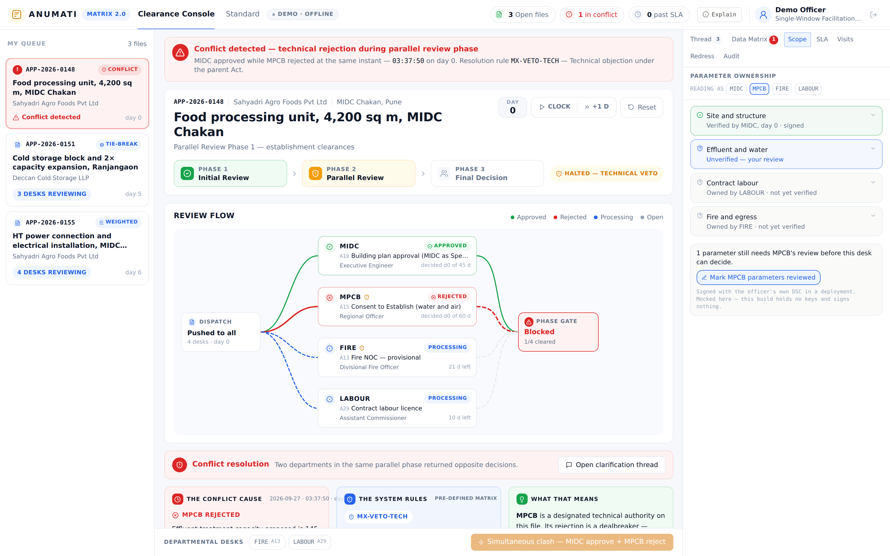

This does **not** claim to catch a bad approval — a careless officer can still tick every box. What it stops is that mistake spreading into another domain, and what it leaves behind is a record of exactly who cleared what. Signing is mocked in this build and says so on screen; a deployment carries the reference to the signature the issuing system already holds, made with the officer's own DSC. The key never reaches this product.

---

### 20. The audit trail — every step, with the provision it was taken under
Nothing in the console is a bare state change. A dispatch, a decision, an escalation, a transfer to the Committee and a parameter sign-off each land on the trail with the day, the actor, and — where a rule rather than a person drove it — the section it was taken under.

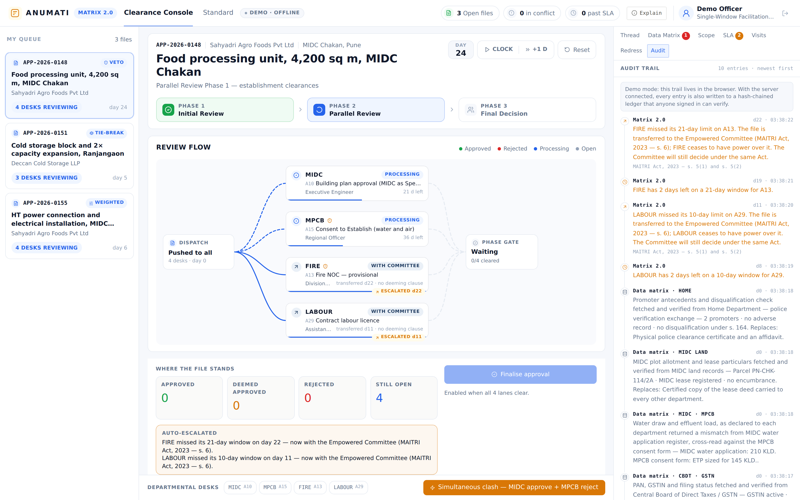

---

### 21. Two clocks, and the product never pretends they are the same
**Statutory** is what the Acts allow. **Observed** is the median of what applicants reported actually waiting, computed from 51 readable field reports rather than typed in by us. On the same MIDC plot the two answer differently — 223 days on the critical path against 319 — and the second number is labelled seeded pilot data wherever it appears.

| Clock | Critical path | Filed in series | What it is |
|---|---|---|---|
| Statutory | 223 days | 464 days | The sum of notified time limits. What you are entitled to. |
| Observed | 319 days | 639 days | Median reported wait, seeded pilot data. What to plan for. |

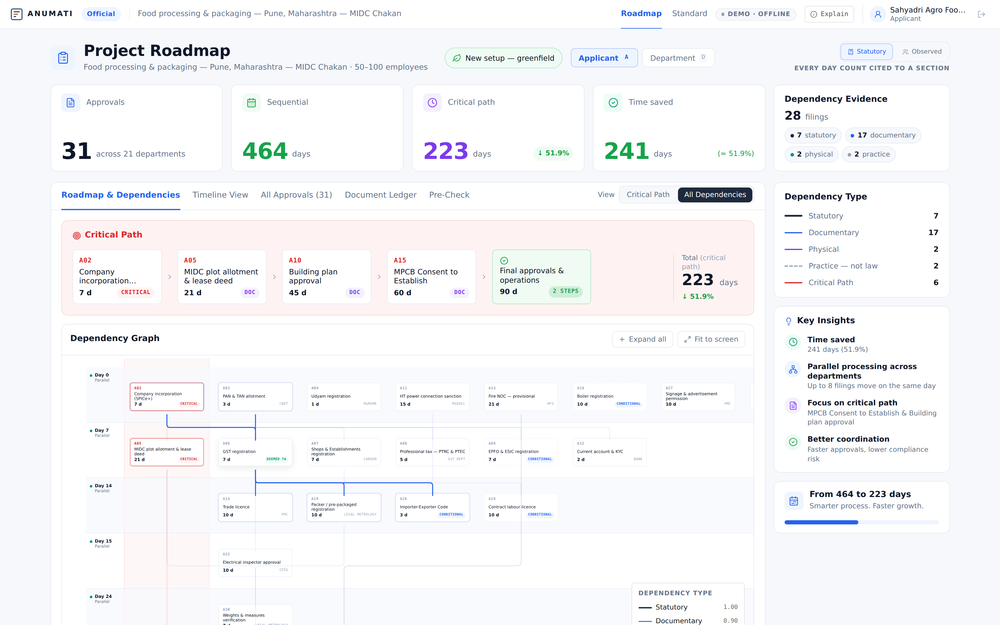

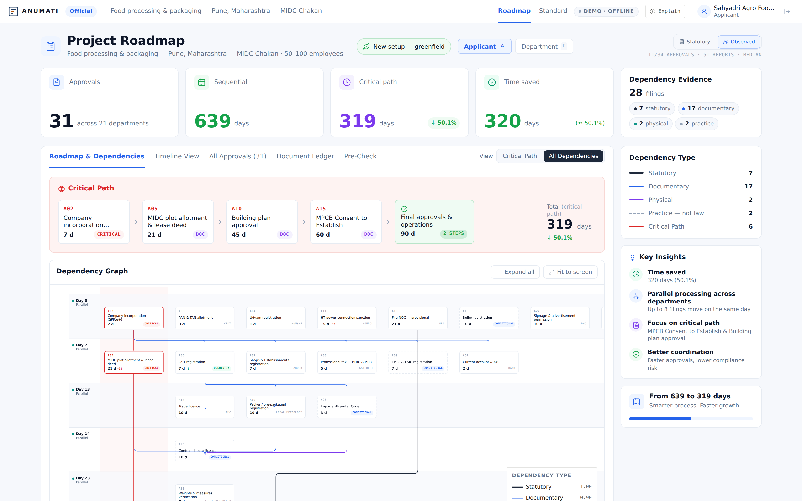

---

### 22. Live mode: the desks that need a server
Three screens exist only when the API is running, because each one writes something a browser has no business holding on its own:

| Screen | Who reaches it | What it holds |
|---|---|---|
| `/applications` | the applicant | Files actually submitted, their documents and their state |
| `/committee` | the Empowered Committee account | Files transferred under s. 5 and grievances raised under s. 8 |
| `/rules` | the rule reviewer account | The extraction pipeline's drafts, waiting for a named sign-off |

In the offline demo these are not reachable — there is no committee or reviewer account to sign in as, and nothing for them to read. Start the server (below) and sign in as `committee` / `demo` or `reviewer` / `demo`.

---

## Every feature maps to a section of the state's own Act

ANUMATI does not ask Maharashtra to legislate anything new. The MAITRI Act, 2023 already provides the machinery; this is the software that uses it.

| ANUMATI feature | MAITRI Act, 2023 |
|---|---|
| Dependency roadmap and sequencing | s. 20 — Online Wizard Module |
| Concurrent dispatch to every department | s. 4 — application through the Nodal Agency |
| Missed time limit transfers the file | s. 5 — Competent Authority ceases to have power |
| Tie-breaker decisions bind both sides | s. 6, s. 9 — Empowered Committee and binding effect |
| Joint inspection planner | s. 16 — inspections conducted jointly, random selection |
| Grievance button | s. 8 — power to call for reasons and inquire |
| Reform simulator and field reports | s. 15 — reforms proposed from user feedback |
| Delay analytics | s. 8 — review of applications pending beyond the limit |
| Adoption without amending any other state law | s. 25 — overriding effect |

**The one thing the console will never do:** grant a clearance an Act would have refused. Even the Empowered Committee disposes of a transferred application *under the relevant law* (s. 5(3)), and the code follows that — a transferred lane stays open until it is actually decided.

---

## Questions a jury will ask, and the answers

| Question | Answer |
|---|---|
| "MAITRI 2.0 already does this" | Yes — for the service list, tracking, incentives and grievance intake. No for **order**, **pre-submission checking**, **joint inspection planning** and **conflict handling**. We add only those four, on top of MAITRI rather than beside it. |
| "Where does 255 days come from?" | The sum of notified time limits in series against the critical path through them. **Modelled, not measured.** The observed clock is a separate number, computed from field reports, and labelled as seeded pilot data. |
| "Who verified these rules?" | We did, from the bare acts — every row names its Act and section, and the screen says `read from the bare act, officer review pending`. 11 of 34 are read; the other 23 are marked unverified rather than hidden. The review queue exists for exactly that gap. |
| "Can your system overrule MPCB?" | No. Even the Empowered Committee disposes of a transferred application **under the relevant law** — MAITRI Act s. 5(3). The console routes; it never decides a clearance. |
| "What if a law changes?" | Rules are versioned with effective dates. A roadmap generated today resolves against the rules as they stood today. |
| "Why would MAITRI adopt this?" | s. 15 already asks the Nodal Agency to propose reforms from user feedback. This is the instrument for that job — the reform simulator runs on the rule graph and refuses reforms the statute does not permit. |
| "Is the decision matrix your invention?" | Two of the three rows are drawn from enacted provisions and are marked `IN FORCE`. The third is a pilot parameter and is marked `DRAFT — NOT NOTIFIED` on every screen that shows it. |

---

## Tests

```bash
cd anumati-web
npm test          # 111 tests: rule base, matrix engine, clocks, compliance, OAGS validator
npm run typecheck # strict TypeScript, no errors
npm run build     # production bundle


cd ../anumati-server
npm test          # the API, the guards and the ledger's hash chain
npm run ledger:verify   # re-walks the decision ledger and fails on a broken link
```

The suite is written against the pure engines, which is where the claims live. Some of
it exists to stop specific errors coming back:

- no deeming clause may be attributed to the Right to Public Services Act;
- no approval may claim a deeming clause without naming the provision that grants it;
- no invented individual may appear as a verifier;
- the two hero numbers (223 / 464 and 255 / 524) are **locked**, so a silent drift in
  the rule base breaks a test rather than quietly making a public claim untrue;
- **our own published rule base must pass our own validator.** If we publish a standard
  and our file fails it, nothing else in the suite matters.

---

## API

Five route handlers, live in the app. No key, CORS open, nothing stored — the rule base
is published under CC BY 4.0 and the validator holds nothing it is given.

| Method | Path | What it returns |
|---|---|---|
| `GET` | `/api/v1/standard/schema` | The OAGS JSON Schema, draft 2020-12 |
| `GET` | `/api/v1/standard/export` | Our Maharashtra rule base in OAGS. `?as_of=YYYY-MM-DD` for a past date |
| `POST` | `/api/v1/standard/validate` | Validates a posted OAGS document |
| `GET` | `/api/v1/approvals` | The rule base. `?as_of=`, `?stage=`, `?department=` |
| `POST` | `/api/v1/roadmap` | Builds a roadmap. `{ conditions, clock: "statutory" \| "observed" }` |

```bash
# Our own file, through our own validator
curl -s localhost:3000/api/v1/standard/export \
  | curl -s -X POST -H 'content-type: application/json' --data-binary @- \
      localhost:3000/api/v1/standard/validate

# 31 approvals, 223 days on the critical path against 464 filed in series
curl -s -X POST -H 'content-type: application/json' \
  -d '{"conditions":{"midc_land":true,"boiler":true,"factory":true}}' \
  localhost:3000/api/v1/roadmap
```

The validator runs the four checks the `/standard` page names — schema conformance,
citation on every rule, no cycles, no orphans. An invalid document still returns `200`:
the caller asked whether it validates, and "no, here is why" answers that question. A
warning is a remark and does not fail a file; an error does.

---

## Key Innovations & Core Architecture

### 1. Four-Tier Typed Dependency Evidence Matrix
Rather than treating all dependencies equally, ANUMATI classifies every edge connecting two approvals into four distinct categories with explicit confidence scores:

| Icon | Edge Type | Statutory Source | Confidence | Description |
|:---:|:---|:---|:---:|:---|
| 🔒 | **Statutory** | Written in Act / Rules | **1.00** | Legally binding prerequisite (e.g., Building Plan Approval requires NA Order under MLRC 1966 s. 44). |
| 📄 | **Documentary** | Departmental Form Requirement | **0.90** | Department B requires the certificate of Department A as an application attachment. |
| ⚙️ | **Physical** | Physical Reality | **1.00** | Physically impossible in reverse order (e.g., Factory inspection requires completed building structure). |
| 🤝 | **Practice** | Departmental Convention | **0.50** | Unwritten convention or bureaucratic custom. Flagged to the applicant and reformable by policy makers. |

### 2. Dual-Persona Architecture — two products behind one sign-in
- **Applicant Persona (Beneficiary)**: The execution roadmap — the dependency graph, the critical path, the document ledger, upcoming requirements and immediate next steps.
- **Officer Persona (DIC / MAITRI Facilitation Officer)**: The Matrix 2.0 clearance console — a queue of live files, concurrent departmental dispatch, SLA clocks with auto-escalation and deemed approval, the conflict resolution protocol, the shared data matrix, and a cited audit trail.

The two are gated by role in both directions, so the officer's screen carries no applicant-side material at all. See [`docs/MATRIX_2.0.md`](docs/MATRIX_2.0.md).

### 3. Pre-Defined Decision Matrix (Governance as Data)
Parallel dispatch removes the one useful property of sequential filing: that a file is only ever on one desk, and so can never be approved and rejected at once. The tie-break that replaces it is stored as **cited data rows**, not as branches in the console — `veto`, `escalation` and `weighted`, each carrying the Rule, GR or Policy clause it is drawn from. A state that tie-breaks differently edits a row; it does not edit the product.

### 4. Mathematical Optimization (CPM)
- Implements standard **Critical Path Method (CPM)** algorithms to compute earliest start, earliest finish, slack/float times, and the critical spine.
- Real-time reactivity: Adjusting employee headcount, building height, or operational conditions dynamically recalculates the graph in milliseconds.

---

## Complete Architecture Flow & System Mechanics

ANUMATI operates as a multi-tier regulatory intelligence system engineered for deterministic execution, statutory fidelity, and auditability. The architecture maps directly from verified statutory instruments to mathematical graph algorithms and dual-persona operational consoles.

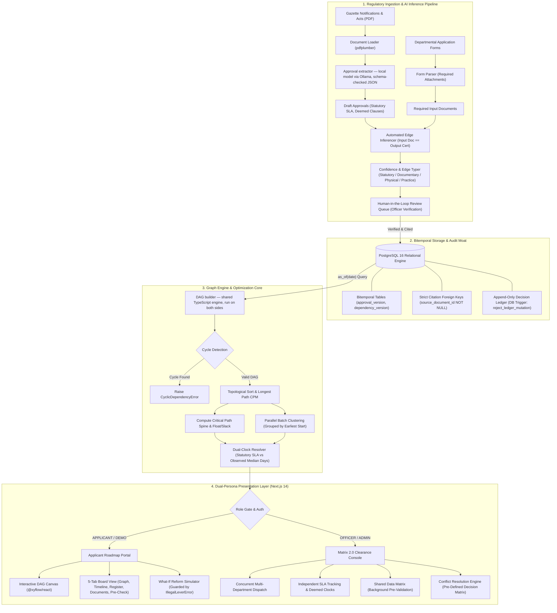
```mermaid
flowchart TD
    subgraph INGESTION["1. Regulatory Ingestion & AI Inference Pipeline"]
        A1["Gazette Notifications & Acts (PDF)"] --> B1["Document Loader (pdfplumber)"]
        A2["Departmental Application Forms"] --> B2["Form Parser (Required Attachments)"]
        B1 --> C1["Approval extractor — local model via Ollama, schema-checked JSON"]
        C1 --> D1["Draft Approvals (Statutory SLA, Deemed Clauses)"]
        B2 --> D2["Required Input Documents"]
        D1 & D2 --> E1["Automated Edge Inferencer (Input Doc == Output Cert)"]
        E1 --> E2["Confidence & Edge Typer (Statutory / Documentary / Physical / Practice)"]
        E2 --> F1["Human-in-the-Loop Review Queue (Officer Verification)"]
    end

    subgraph STORAGE["2. Bitemporal Storage & Audit Moat"]
        F1 -->|"Verified & Cited"| G1[("PostgreSQL 16 Relational Engine")]
        G1 --- H1["Bitemporal Tables (approval_version, dependency_version)"]
        G1 --- H2["Strict Citation Foreign Keys (source_document_id NOT NULL)"]
        G1 --- H3["Append-Only Decision Ledger (DB Trigger: reject_ledger_mutation)"]
    end

    subgraph COMPUTE["3. Graph Engine & Optimization Core"]
        G1 -->|"as_of(date) Query"| I1["DAG builder — shared TypeScript engine, run on both sides"]
        I1 --> I2{"Cycle Detection"}
        I2 -->|"Cycle Found"| ERR["Raise CyclicDependencyError"]
        I2 -->|"Valid DAG"| I3["Topological Sort & Longest Path CPM"]
        I3 --> I4["Compute Critical Path Spine & Float/Slack"]
        I3 --> I5["Parallel Batch Clustering (Grouped by Earliest Start)"]
        I4 & I5 --> I6["Dual-Clock Resolver (Statutory SLA vs Observed Median Days)"]
    end

    subgraph PRESENTATION["4. Dual-Persona Presentation Layer (Next.js 14)"]
        I6 --> J1{"Role Gate & Auth"}
        J1 -->|"APPLICANT / DEMO"| K1["Applicant Roadmap Portal"]
        J1 -->|"OFFICER / ADMIN"| K2["Matrix 2.0 Clearance Console"]
        
        K1 --> L1["Interactive DAG Canvas (@xyflow/react)"]
        K1 --> L2["5-Tab Board View (Graph, Timeline, Register, Documents, Pre-Check)"]
        K1 --> L3["What-If Reform Simulator (Guarded by IllegalLeverError)"]
        
        K2 --> M1["Concurrent Multi-Department Dispatch"]
        K2 --> M2["Independent SLA Tracking & Deemed Clocks"]
        K2 --> M3["Shared Data Matrix (Background Pre-Validation)"]
        K2 --> M4["Conflict Resolution Engine (Pre-Defined Decision Matrix)"]
    end
```

### 1. Ingestion & Automated Documentary Edge Inference Pipeline
The primary technical barrier in single-window portals is manual graph construction. ANUMATI automates regulatory graph construction directly from primary government sources while strictly prohibiting unverified auto-publishing:

1. **Extraction**: Gazette PDFs and notifications are parsed via `pdfplumber` into text with exact page coordinate mappings. A local model, prompted for JSON and validated against a pydantic schema, extracts statutory SLAs, deemed approval clauses and citations. A draft that fails validation is dropped and logged, never repaired.
2. **Form Parsing**: Departmental application forms are analyzed to extract their list of mandatory attachments (`required_documents[]`).
3. **Automated Edge Inference**:
   The core mathematical discovery: If approval $B$'s application form requires a document that approval $A$ produces, then approval $A$ is an indisputable prerequisite for approval $B$:
   $$\forall B \in \text{Approvals}, \forall d \in B.\text{required\_documents}: \text{If } \exists A \text{ s.t. } A.\text{produces\_document} = d \implies \text{Edge}(A \to B, \text{type}=\text{DOCUMENTARY}, \text{confidence}=0.90)$$
4. **Human-in-the-Loop Sign-off**: Every extracted approval and edge lands as `ReviewStatus.DRAFT`. A facilitation officer must verify the section citation and effective date before it is `PUBLISHED`. The database enforces `source_document_id NOT NULL` and `source_section NOT NULL`.

---

### 2. Mathematical Optimization & Dual-Clock Critical Path Method (CPM)

ANUMATI models the regulatory landscape as a directed acyclic graph $G = (V, E)$. 

1. **Topological Sort & Cycle Detection**:
   The graph is traversed in topological order. If a cycle is introduced, `CyclicDependencyError` is raised immediately to halt corrupt sequences.
2. **Earliest Finish & Critical Path**:
   For every node $i$ with statutory or observed duration $D_i$:
   $$\text{EarliestStart}(i) = \max_{p \in \text{Predecessors}(i)} \text{EarliestFinish}(p), \quad \text{EarliestFinish}(i) = \text{EarliestStart}(i) + D_i$$
   The critical path spine is the longest path from entry node to project completion with zero float ($Float_i = \text{LatestStart}_i - \text{EarliestStart}_i = 0$).
3. **Parallel Batch Clustering**:
   Approvals are grouped into concurrent processing lanes based on identical Earliest Start milestones:
   $$\text{Batch}(t) = \{ v \in V \mid \text{EarliestStart}(v) = t \}$$
4. **Dual-Clock Architecture**:
   - **Statutory Clock**: Exact notified days allowable under each sectoral Act (Total Series: 524 days $\to$ Critical Path: 255 days on private land; 464 days $\to$ 223 days in MIDC plots).
   - **Observed Clock**: Empirical field-reported medians aggregated per approval ($Sample \ge 1$), revealing actual bureaucratic wait times (e.g. Building Plan taking 92 days vs 60 days statutory SLA).

---

### 3. Matrix 2.0: Concurrent Dispatch & Conflict Resolution State Machine

Under sequential filing, conflicts are impossible because a file only sits on one desk at a time. ANUMATI's concurrent multi-departmental dispatch creates parallel processing lanes from Day 0, requiring a deterministic conflict resolution engine when departments disagree:

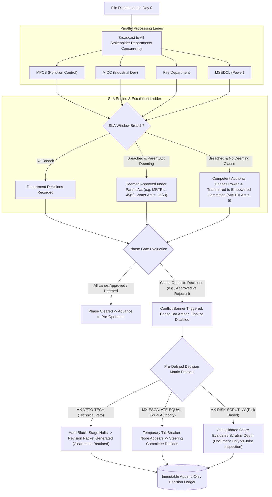
```mermaid
flowchart TD
    DISPATCH["File Dispatched on Day 0"] --> LANES["Broadcast to All Stakeholder Departments Concurrently"]
    
    subgraph PARALLEL_LANE["Parallel Processing Lanes"]
        LANES --> L_MPCB["MPCB (Pollution Control)"]
        LANES --> L_MIDC["MIDC (Industrial Dev)"]
        LANES --> L_FIRE["Fire Department"]
        LANES --> L_DISCOM["MSEDCL (Power)"]
    end

    subgraph SLA_WATCH["SLA Engine & Escalation Ladder"]
        L_MPCB & L_MIDC & L_FIRE & L_DISCOM --> CLK{"SLA Window Breach?"}
        CLK -->|"No Breach"| EVAL["Department Decisions Recorded"]
        CLK -->|"Breached & Parent Act Deeming"| DEEM["Deemed Approved under Parent Act (e.g. MRTP s. 45(5), Water Act s. 25(7))"]
        CLK -->|"Breached & No Deeming Clause"| ESC["Competent Authority Ceases Power -> Transferred to Empowered Committee (MAITRI Act s. 5)"]
    end

    EVAL & DEEM & ESC --> GATE{"Phase Gate Evaluation"}
    
    GATE -->|"All Lanes Approved / Deemed"| PASS["Phase Cleared -> Advance to Pre-Operation"]
    GATE -->|"Clash: Opposite Decisions (e.g., Approved vs Rejected)"| CONFLICT["Conflict Banner Triggered: Phase Bar Amber, Finalize Disabled"]
    
    CONFLICT --> RESOLVE{"Pre-Defined Decision Matrix Protocol"}
    
    RESOLVE -->|"MX-VETO-TECH (Technical Veto)"| VETO["Hard Block: Stage Halts -> Revision Packet Generated (Clearances Retained)"]
    RESOLVE -->|"MX-ESCALATE-EQUAL (Equal Authority)"| TIE["Temporary Tie-Breaker Node Appears -> Steering Committee Decides"]
    RESOLVE -->|"MX-RISK-SCRUTINY (Risk-Based)"| RISK["Consolidated Score Evaluates Scrutiny Depth (Document Only vs Joint Inspection)"]
    
    VETO & TIE & RISK --> LEDGER[("Immutable Append-Only Decision Ledger")]
```

#### The Three Governance Rules:
- **`MX-VETO-TECH` (Technical Veto)**: A designated technical authority (e.g. MPCB on pollution or DISCOM on electrical capacity) holds statutory veto power. Its rejection halts the stage. **Send for Revision** packages only the objection and retains all approved clearances so nothing is re-filed.
- **`MX-ESCALATE-EQUAL` (Equal Authority)**: Two departments have equal standing with no legal hierarchy (e.g. Town Planning vs Heritage). Neither may overrule the other; the system dynamically renders a temporary **Tie-Breaker Panel** node and routes the file to the Empowered Committee.
- **`MX-RISK-SCRUTINY` (Risk-Based Scrutiny)**: Departments submit risk scores ($0 - 100$) instead of voting. A weighted consolidated score determines the depth of inspection (documents-only vs joint physical inspection). **The score never grants or denies a statutory clearance.**

---

### 4. Data Layer Architecture: Bitemporal Versioning & Append-Only Ledger

The data model is engineered around two core principles:

1. **Bitemporal Rule Versioning**:
   Every regulatory approval and dependency edge carries valid time (`effective_from`, `effective_to`) and system transaction time (`recorded_at`, `superseded_at`). All engine queries execute against `as_of(date)` snapshots:
   ```python
   # Guarantees roadmaps generated in 2026 remain bit-for-bit reproducible in 2030
   select(ApprovalVersion).where(
       ApprovalVersion.effective_from <= as_of_date,
       or_(ApprovalVersion.effective_to.is_(None), ApprovalVersion.effective_to > as_of_date),
       ApprovalVersion.review_status == ReviewStatus.PUBLISHED
   )
   ```
2. **Append-Only Decision Ledger**:
   Every administrative decision, SLA escalation, deemed approval, and committee intervention is written to an immutable `decision_ledger` table with database triggers that physically reject `UPDATE` and `DELETE` queries:
   ```sql
   CREATE OR REPLACE FUNCTION reject_ledger_mutation() RETURNS trigger AS $$
   BEGIN
     RAISE EXCEPTION 'decision_ledger is append-only';
   END; $$ LANGUAGE plpgsql;

   CREATE TRIGGER ledger_no_update BEFORE UPDATE OR DELETE ON decision_ledger
   FOR EACH ROW EXECUTE FUNCTION reject_ledger_mutation();
   ```

---

### 5. Policy Reform Simulator with Statutory Guardrails

ANUMATI provides policymakers with an evidence-based sandbox to test reforms before notifying them:
- **`REDUCE_TIMELINE`**: Models the macro impact of shortening an approval's statutory SLA window.
- **`PARALLELISE`**: Eliminates practice-based conventions or inter-departmental bottlenecks.
- **`ENFORCE_DEEMED`**: Simulates automated deemed approvals for silent counters.
- **Statutory Guardrail (`IllegalLeverError`)**:
  ```python
  if edge["edge_type"] == EdgeType.STATUTORY:
      raise IllegalLeverError("Cannot parallelise a statutory dependency")
  ```
  The simulator structurally refuses to bypass binding statutory requirements written into parent Acts. Reforms can only target bureaucratic practice conventions and notified timelines.

---

## Strategic Implementation Plan

Our vision is to transform ANUMATI from an award-winning prototype into an institutional public digital infrastructure powering single-window facilitation nationwide.

```
┌─────────────────────────────────────────────────────────────────────────────┐
│                       ANUMATI STRATEGIC ROADMAP                             │
├─────────────────┬──────────────────┬──────────────────┬─────────────────────┤
│    PHASE 1      │     PHASE 2      │     PHASE 3      │      PHASE 4        │
│ Standalone MVP  │ Backend Engine   │ Ingestion &      │ State Integration   │
│ & Seeded Rules  │ & Versioning DB  │ Review Pipeline  │ & National Rollout  │
│   (COMPLETED)   │   (Month 1-2)    │   (Month 3-5)    │    (Month 6-12)     │
└─────────────────┴──────────────────┴──────────────────┴─────────────────────┘
```

### Phase 1: Standalone MVP & Seeded Regulatory Rules (Completed)
- Full Next.js 14 frontend with client-side reactive graph engine.
- Verified seed rule base for Maharashtra industrial manufacturing & food processing (34 approvals, 27 cited Acts & Government Resolutions).
- Interactive DAG visualization with custom React Flow nodes and typed edges.
- Policy Reform Simulator with statutory guardrails.
- Document Re-verification audit ledger.
- OAGS (Open Approval Graph Standard) specification v0.1.
- **Matrix 2.0 officer console**: role sign-in, concurrent departmental dispatch, the conflict resolution protocol across all three governance rules, SLA auto-escalation and deemed approval, the shared data matrix, cross-departmental clarification threads, and a cited audit trail.

### Phase 2: Server, Database and Decision Ledger (Built — `anumati-server/`)
- **Fastify 5 API and worker on Node 22.** It imports the web app's engine rather than reimplementing it, so a roadmap, a clock or a conflict is computed identically on both sides — and the server's answer is the one that counts.
- **PostgreSQL 16.** Bitemporal rule tables (`effective_from`, `effective_to`): a roadmap generated today stays reproducible after the law changes.
- **Append-only decision ledger.** SHA-256 hash chain, advisory-locked appends, `UPDATE`/`DELETE`/`TRUNCATE` blocked by database triggers, a daily anchor, and `npm run ledger:verify` to check the chain.
- **Real boundaries.** scrypt passwords, HS256 tokens, and every command re-checked server-side — a department desk can act on its own rows and no others.
- **Still stood in, and labelled as such:** government registry calls answer from recordings (`ADAPTER_MODE=fixture`), and officer signatures use a demo key marked "not a DSC" until real credentials are configured.

### Phase 3: Extraction with Human Sign-off (Built — `anumati-extraction/`)
- **Reads a notified instrument** — gazette, Act, department form — with pdfplumber, falling back to OCR, and proposes approvals through a local model with schema-checked JSON output.
- **Infers documentary edges** from the forms themselves: where one approval produces a document another's form requires, that is a dependency with evidence behind it.
- **It only ever drafts.** Every proposal lands in the Rule review queue and a named reviewer publishes or rejects it with a note. Invalid drafts are dropped and logged, never repaired. Nothing reaches the rule base without a citation and a human.

### Phase 4: Pilot Deployment & Single-Window Integration (Month 6 - 8)
- **District Pilot**: Field testing with the District Industries Centre (DIC) Pune and Maharashtra Industrial Development Corporation (MIDC) Chakan facilitation cell.
- **MAITRI / NSWS Connector**: API integration enabling applicants to jump directly from their ANUMATI roadmap into the corresponding form on the state or national single-window portal.
- **DigiLocker Integration**: Verification of pre-existing documents directly from DigiLocker, eliminating redundant uploads for 15+ recurring documents.

### Phase 5: Multi-State Expansion & Empirical Feedback Moat (Month 9 - 12+)
- **Multi-State Scaling**: Expanding rule sets to high-growth industrial states (Tamil Nadu, Gujarat, Karnataka, Uttar Pradesh, Telangana).
- **Closed-Loop Delay Reporting**: When an applicant experiences an objection or rejection at a counter, they can log it with one click. This feeds empirical rejection frequency data back into the engine, creating a defensible data moat for ease-of-doing-business governance.

---

## Technology Stack

| Layer | Technologies used |
|---|---|
| **Web app** | Next.js 14 (App Router), React 18, TypeScript 5.7 strict |
| **Styling** | Tailwind CSS 3.4, custom design tokens as CSS variables |
| **Graph canvas** | @xyflow/react (React Flow v12) |
| **Client state** | Zustand v5 |
| **Icons** | Lucide React |
| **Rule engine** | Plain TypeScript, no framework. Pure functions over a typed DAG — `buildRoadmap`, `derive`. Shared verbatim between browser and server |
| **API & worker** | Fastify 5 on Node 22, pg-boss for jobs, zod for request schemas, jose for tokens, pino for logs |
| **Database** | PostgreSQL 16 with SQL migrations. Bitemporal rule tables; the decision ledger is append-only, enforced by triggers |
| **Extraction** | Python 3.11, pdfplumber (tesseract OCR fallback), a local model via Ollama, pydantic validation |
| **Schema standard** | OAGS v0.1 — published by this repo, with a validator |
| **Tests** | vitest — 111 in `anumati-web`, plus the server's own suite in `anumati-server` |

---

## Quickstart & Local Setup

Three ways in, shortest first.

### 1. Offline demo — one command, nothing to install but npm

Everything runs in the browser against the seeded rule base. No database, no Python, no keys.

```bash
git clone https://github.com/shubham54191/ANUMATI.git
cd ANUMATI/anumati-web
npm install
npm run dev                  # http://localhost:3000
```

Sign in with either demo account — credentials are case-insensitive and trimmed:

| User id | Password | Opens |
|---|---|---|
| `OFFICER` | `ADMIN` | Matrix 2.0 clearance console — dispatch, conflict resolution, SLA escalation, the shared data matrix |
| `APPLICANT` | `DEMO` | Applicant roadmap — dependency graph, critical path, document ledger, pre-check |

**Continue as the demo applicant** on the sign-in screen skips the credentials for the applicant side.
The chrome reads `DEMO · OFFLINE` throughout, and the **Explain** switch in the top bar turns on the
notes about how each screen works — off by default, so a working screen stays short.

### 2. Full stack — web, API, worker and PostgreSQL

```bash
cp .env.example .env          # set JWT_SECRET: openssl rand -hex 32
docker compose up --build     # web :3000 · API :4000
```

This adds the accounts, files, decision ledger and the three live-mode desks. Sign in as
`applicant`/`demo`, `officer`/`admin`, a department desk (`mpcb`, `midc`, `fire`, `dish`, `msedcl`,
`ceig`, `labour` — all `/demo`), `committee`/`demo` or `reviewer`/`demo`. The badge on every screen
says what is live and what is recorded: government systems answer from recordings, and signatures use
a labelled demo key, until real credentials and DSCs are configured.
Details: [`anumati-server/README.md`](anumati-server/README.md).

### 3. Extraction pipeline — drafting rules from a gazette PDF

Offline, never in a request path, and it only ever drafts.
See [`anumati-extraction/README.md`](anumati-extraction/README.md).

### Prerequisites
- **Node.js** 18.17+ for the web app; **Node 22** for the server. Tested on Node 24.16.
- **npm** 9+
- Docker, only for option 2.

### Running on a different port

```bash
npm run dev -- -p 3001
```

### Production Build & Verification
To verify type safety and produce an optimized production bundle:
```bash
npm run typecheck    # Runs TypeScript compiler check (0 errors)
npm run build        # Generates production bundle
npm run start        # Starts production server on http://localhost:3000
```

---

## Project Structure

```
ANUMATI/
├── README.md                       # This document
├── docker-compose.yml              # Web + API + worker + PostgreSQL, one command
├── screenshots/                    # 32 screenshots, all taken from the current build
├── docs/
│   ├── MATRIX_2.0.md               # Conflict protocol, state machine, 4-minute demo script
│   ├── TWO_ACCOUNTS.md             # The applicant/officer split and why it exists
│   ├── INTEGRITY_FRONTEND_BACKEND.md
│   ├── architecture/               # System architecture, process flow, tech stack (+ diagrams)
│   ├── BACKEND_ARCHITECTURE.md
│   ├── FRONTEND_ARCHITECTURE.md
│   └── SIH_PRESENTATION_PLAN.md
│
├── anumati-web/                    # The product — Next.js 14
│   ├── app/
│   │   ├── login/                  # Sign-in; each role is sent to its own product
│   │   ├── roadmap/new/            # Setup wizard
│   │   ├── roadmap/[roadmapId]/    # Graph, timeline, register, ledger, pre-check
│   │   │   └── simulate/           # Policy reform simulator
│   │   ├── matrix/                 # Matrix 2.0 clearance console
│   │   ├── applications/           # Applicant's filed applications        (live mode)
│   │   ├── committee/              # Empowered Committee desk              (live mode)
│   │   ├── rules/                  # Rule review queue                     (live mode)
│   │   ├── standard/               # OAGS specification and live validator
│   │   └── api/v1/                 # Public API — schema, export, validate, approvals, roadmap
│   ├── components/
│   │   ├── auth/                   # Role gate
│   │   ├── graph/                  # React Flow nodes, batch lanes, edge renderers
│   │   ├── matrix/                 # Parallel track, conflict screen, tie-breaker, SLA board,
│   │   │                           #   data matrix, parameter scope, thread, audit trail
│   │   ├── precheck/               # Pre-validation, risk score, inspections, renewals
│   │   ├── register/ documents/    # Statutory register · re-verification ledger
│   │   ├── committee/ rules/       # Live-mode desks
│   │   └── ui/                     # Buttons, dialogs, the Explain switch
│   ├── lib/
│   │   ├── data/                   # Seeded Maharashtra rule base + field reports
│   │   ├── graph/                  # CPM critical path, layout
│   │   ├── matrix/                 # Decision matrix, seeded files, conflict state machine
│   │   ├── compliance/             # Pre-validation, risk, inspections, renewals
│   │   ├── oags/                   # The published schema, the export, the validator
│   │   └── api/                    # Client for the server; HTTP helpers for the routes
│   ├── store/  types/  tests/      # Zustand stores · domain models · 111 vitest tests
│
├── anumati-server/                 # API and worker — Fastify 5, PostgreSQL 16
│   ├── migrations/                 # 001_init · 002_ledger · 003_signature_cert
│   └── src/
│       ├── auth/                   # scrypt passwords, tokens, per-route guards
│       ├── matrix/                 # Commands, store, service — the officer's writes
│       ├── engine/bridge.ts        # Imports anumati-web/lib: one engine, both sides
│       ├── ledger/                 # Append-only hash chain and its verifier
│       ├── adapters/               # Government systems; recorded answers + circuit breaker
│       └── jobs/                   # Deliveries, registry checks, SLA sentinel, renewals
│
└── anumati-extraction/             # Offline drafting pipeline — Python 3.11
    └── anumati_extract/            # PDF → pages → model → validated drafts → review queue
```

---

## Statutory Rules & Legal References Cited

All regulatory data in the seed is grounded in published Acts, Rules, and Notifications, including:
- **Maharashtra Land Revenue Code (MLRC) 1966**, Section 44 (Non-Agricultural Land-use Permission)
- **Companies Act 2013**, Section 7 (SPICe+ Incorporation)
- **Electricity Act 2003**, Section 43 (High Tension Power Sanction)
- **Maharashtra Fire Prevention & Life Safety Measures Act 2006**, Section 3 (Provisional Fire NOC)
- **Water (Prevention & Control of Pollution) Act 1974** & **Air Act 1981** (MPCB Consent to Establish)
- **Factories Act 1948**, Section 6 & **Maharashtra Factory Rules 1963** (Factory Plan Approval)
- **Food Safety and Standards Act 2006**, Section 31 (FSSAI Manufacturing Licence)
- **Maharashtra Industry, Trade and Investment Facilitation Act 2023** (Mah. Act XXXIV of 2023) — single window, Empowered Committee, transfer on delay, joint inspection
- **Maharashtra Right to Public Services Act 2015** (appeal under s. 9; penalty on the designated officer under s. 10 — *not* a deeming provision)

---

## Smart India Hackathon 2026 Team

- **Problem Statement**: SIH26130 · Inter-departmental Regulatory Approvals & Workflow Coordination
- **Solution Name**: ANUMATI (अनुमति)
- **GitHub Repository**: [https://github.com/shubham54191/ANUMATI](https://github.com/shubham54191/ANUMATI)

---
*Built with precision for Smart India Hackathon 2026.*
