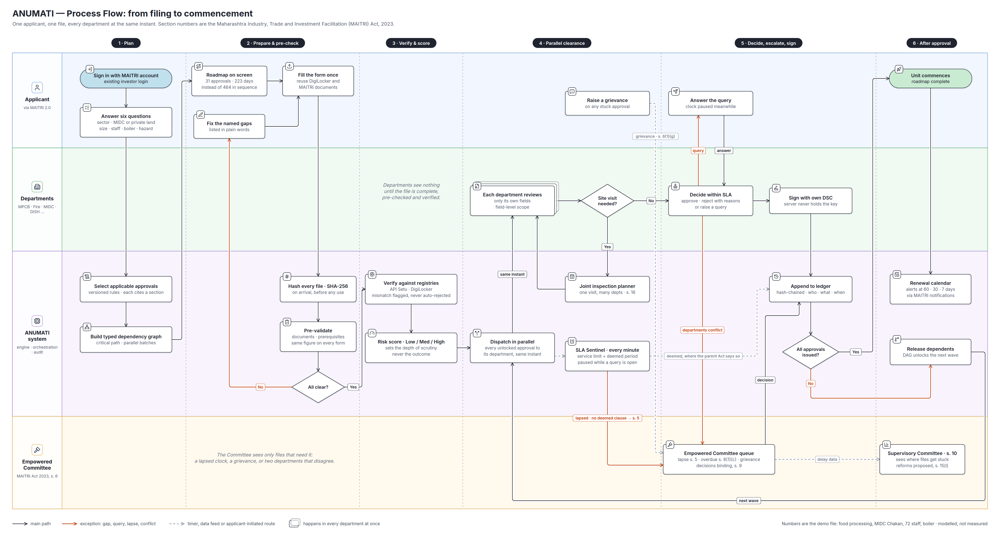

# ANUMATI (SIH26130) — Process Flow, step by step

| | |
|---|---|
| What this is | The journey of one application from sign-in to commencement and renewal — every step, every decision, every exception, who acts, what the law says, and where it shows in the demo |
| Diagram | `anumati-process-flow.png` |
| Companion | `ANUMATI_SYSTEM_ARCHITECTURE.md` (which component does each step) · `ANUMATI_TECH_STACK.md` |
| Law cited | Maharashtra Industry, Trade and Investment Facilitation Act, 2023 (**MAITRI Act**), unless another Act is named |
| Written | 26 Sep 2026 |

---

## 1. How to read the diagram

**Four lanes — who acts.**

| Lane | Who | Colour |
|---|---|---|
| Applicant | Investor or consultant, signed in through MAITRI 2.0 | blue |
| Departments | Every sectoral authority on the file — MPCB, Fire, MIDC, DISH, MSEDCL, CEIG, Labour … | green |
| ANUMATI system | Engine, orchestration, integrity | purple |
| Empowered Committee | MAITRI Act s. 6, chaired by the Development Commissioner (Industries); the Supervisory Committee (s. 10) above it | amber |

**Six phases — when.** Plan → Prepare & pre-check → Verify & score → Parallel
clearance → Decide, escalate, sign → After approval.

**Three kinds of line.**

| Line | Meaning |
|---|---|
| Black | The main path |
| Red | An exception — a pre-check gap, a query, a lapsed clock, a conflict |
| Grey | A timer, a data feed, or a route the applicant starts (grievance) |

A card drawn as a **stack** happens in every department at once.

**Two empty stretches are deliberate.** The Departments lane is empty through
phases 1–3: no department sees the file until it is complete, pre-checked and
verified. The Committee lane is empty until phase 4: the Committee sees only
files that need it.

---

## 2. The steps

Step codes match the diagram (A = applicant, S = system, Dp = department,
C = committee, D = decision).

### Phase 1 — Plan

| # | Step | Lane | What happens | Output | Basis | In the demo |
|---|---|---|---|---|---|---|
| A1 | **Sign in with MAITRI account** | Applicant | Existing MAITRI 2.0 login; ANUMATI receives an identity token. No new account | Session | Reuse, not rebuild | Login page (demo accounts) |
| A2 | **Answer six questions** | Applicant | Sector · MIDC plot or private land · size · staff · boiler · hazardous material | Answers | Extends the online wizard, s. 20 | `/roadmap/new` |
| S1 | **Select applicable approvals** | System | Engine loads the rule version in force today; each rule carries its Act and section; conditional rules switch on the answers (e.g. no NA conversion inside MIDC) | List of approvals | Every rule cites a section | "All Approvals (31)" tab |
| S2 | **Build typed dependency graph** | System | Statutory, documentary, physical and practice edges with confidence; earliest start and finish; critical path; parallel batches | Roadmap | CPM, stated as such | Roadmap & Dependencies tab |

### Phase 2 — Prepare & pre-check

| # | Step | Lane | What happens | Output | Basis | In the demo |
|---|---|---|---|---|---|---|
| A3 | **Roadmap on screen** | Applicant | Demo file: 31 approvals across 21 departments; 223 days on the critical path instead of 464 in sequence | A plan the applicant can act on | Modelled from notified limits, not measured | Four headline cards |
| A4 | **Fill the form once** | Applicant | One common form; documents reused from DigiLocker and MAITRI's repository instead of re-uploaded per department | Dossier | Common Application Form, s. 15(k) | Document Ledger tab |
| S3 | **Hash every file (SHA-256)** | System | On arrival, before anything reads it; the hash becomes the file's identity | Content-addressed documents | — | Built (server) |
| S4 | **Pre-validate** | System | For the approvals being filed now: (1) required documents present · (2) their prerequisites already issued — later-wave approvals wait in *locked* and are not gaps · (3) the same figure equal on every form — plot no., built-up area, load in kVA, water draw in KLD | Pass, or a list of blocking gaps | — | Pre-Check tab |
| D1 | **All clear?** | System | No → A5. Yes → phase 3 | | | |
| A5 | **Fix the named gaps** | Applicant | Gaps listed in plain words, e.g. *"Connected load declared as 1250 kVA on A11, 1600 kVA on A22"* → back to A4 | Corrected dossier | — | Readiness list |

**Why this phase matters:** today a portal accepts an application and a
department rejects it weeks later for a missing annexure. Everything needed to
catch that is already on the applicant's side of the counter. Pre-validation
is arithmetic, not AI — which is why it can be trusted and audited.

### Phase 3 — Verify & score

| # | Step | Lane | What happens | Output | Basis | In the demo |
|---|---|---|---|---|---|---|
| S5 | **Verify against registries** | System | PAN, CIN, GSTIN, Udyam checked through API Setu; prior approvals pulled from their issuer. A mismatch is **flagged on the officer's screen, never auto-rejected** — a registry can be wrong too | Verified / flagged fields | — | Built with recorded answers (fixture) |
| S7 | **Risk score · Low / Medium / High** | System | From hazard, boiler, height, headcount, pollution category, past rejections. Sets **depth of scrutiny** — document-only vs full inspection — never the outcome | Band per approval | Pilot parameter — the Act provides joint and random inspection (s. 16) but no risk formula | Risk card |

### Phase 4 — Parallel clearance

| # | Step | Lane | What happens | Output | Basis | In the demo |
|---|---|---|---|---|---|---|
| S8 | **Dispatch in parallel** | System | Every approval whose prerequisites are met goes to its department **at the same instant**, in one transaction; one job per department; each department's clock starts | Dispatched approvals | The core of the problem statement | Officer console → Dispatch |
| Dp1 | **Each department reviews only its own fields** | Departments | Reads the whole file, verifies only the parameter groups it owns. MIDC's signature on site and structure is context on MPCB's screen, never clearance for MPCB | Verified field groups | Field-level ownership | Scope tab |
| D3 | **Site visit needed?** | Departments | Yes → S9. No → decision | | | |
| S9 | **Joint inspection planner** | System | Groups site-visit approvals by site and ready date: one visit, many departments → back to Dp1 with findings | Grouped visit | Joint inspection "as far as practicable", s. 16 | Visits tab |
| S14 | **SLA Sentinel · every minute** | System | Runs alongside everything in this phase. Two clocks per department — service time limit and, where it exists, the parent Act's deemed period; paused while a query is open. See §3 | Deemed approval or transfer | s. 5, s. 18; parent Acts | SLA tab, simulated clock |
| A7 | **Raise a grievance** | Applicant | On any stuck approval, at any time → Empowered Committee queue | Grievance case | s. 8(1)(g) | Grievance dialog |

### Phase 5 — Decide, escalate, sign

| # | Step | Lane | What happens | Output | Basis | In the demo |
|---|---|---|---|---|---|---|
| Dp2 | **Decide within SLA** | Departments | Approve · reject **with reasons** · or raise a query | Decision | Reasons required, s. 4(3) | Decision bar |
| A6 | **Answer the query** | Applicant | Reply goes back to the same department; that department's clock is paused meanwhile | Answer | Pause rule is a pilot parameter; confirm against limits notified under s. 18 | Thread tab |
| Dp3 | **Sign with own DSC** | Departments | The document's SHA-256 goes to the officer's Class 3 DSC; the detached signature comes back. The server never holds a key | Signed decision | IT Act 2000, s. 3 and s. 5 | Demo signer, labelled · external DSC verify built |
| C1 | **Empowered Committee queue** | Committee | Receives: lapsed files (s. 5), overdue files (s. 8(1)(c)), grievances (s. 8(1)(g)), and departmental deadlocks (this pilot's reading — see §4). Disposes of transferred files under the relevant law (s. 5(3)); its decisions are binding (s. 9) | Binding decision | s. 5, 6, 8, 9 | Tie-breaker screen |
| S11 | **Append to ledger** | System | Every decision, deemed approval, transfer and Committee decision; hash-chained; who, what, when, which file, which rule version | Ledger row | — | Audit tab |
| D7 | **All approvals issued?** | System | No → S12. Yes → A8 | | | |
| S12 | **Release dependents** | System | The graph says which approvals just unlocked; they are dispatched as the **next wave** → back to S8 | Next wave | — | Timeline scrubber |

### Phase 6 — After approval

| # | Step | Lane | What happens | Output | Basis | In the demo |
|---|---|---|---|---|---|---|
| A8 | **Unit commences** | Applicant | Every approval issued | Commencement | — | Timeline at the end |
| S13 | **Renewal calendar** | System | Each licence's expiry and renewal window; alerts at 60, 30 and 7 days through MAITRI's notification channel | Alerts | — | Renewal board |
| C3 | **Supervisory Committee** | Committee | Sees where files get stuck — which department, which approval, how often; MAITRI proposes reforms from it | Reform proposals | s. 10; reforms from user feedback, s. 15(l) | Reform simulator |

---

## 3. The SLA Sentinel, precisely

The clock is the part judges probe hardest. It works like this.

1. **Clocks start at dispatch**, per department per approval — whether or not
   the department has opened the file.
2. **Elapsed time is computed from events**, never stored: dispatched → query
   raised (pause) → query answered (resume) → decided. A correction to one
   event fixes every figure derived from it.
3. **Two limits, which are different numbers:**

| Clock | Where the number comes from | On lapse | Cited as |
|---|---|---|---|
| **Service time limit** | Notified under MAITRI Act s. 18 | `transferred_to_committee`; the department ceases to have power over the file | s. 5(1), s. 5(2) |
| **Deemed period** — only where the parent Act has one | The parent Act, e.g. four months for water consent | `deemed_approved`; dependents released | That clause — e.g. CGST Rules r. 9(5); Water Act 1974 s. 25(7) |

4. **Whichever lapses first acts, and a transfer does not stop the parent
   Act.** Once transferred under s. 5, the Committee holds the file — but the
   parent Act's deemed period keeps running, because the MAITRI Act does not
   say it overrides the sectoral Act's own deeming clause. If the Committee
   has not decided by then, the approval is deemed. Whether that is right is a
   legal question for the Industries Department; the pilot states its reading
   on screen and in the ledger.
5. **The Committee decides under the relevant law** (s. 5(3)). It cannot grant
   what the sectoral Act forbids. ANUMATI routes; it never decides.

**What was wrong before, and is fixed:** an earlier version cited "RTS Act
2015 s. 5(3)" for deemed approval. That Act has appeals (s. 9) and penalties
(s. 10), not deemed approval. Deemed approval is now driven per approval from
its own Act, and everything else goes to the Committee.

---

## 4. The exception paths, one by one

| Exception | Where it starts | Route | Ends in |
|---|---|---|---|
| **Incomplete or inconsistent file** | Pre-validation (D1) | → A5 fix → A4 | Resubmission; no department ever saw the bad version |
| **Registry mismatch** | S5 | Flag on the officer's Data Matrix | Officer judges it; never an automatic rejection |
| **Query** | Dp2 | → A6 answer (clock paused) → Dp2 | A decision |
| **Clock lapses** | S14 | Deemed (if the parent Act says so) → S11; otherwise → C1 | Ledger / Committee decision |
| **Grievance** | A7, any time | → C1 | Committee decision (s. 8(1)(g)) |
| **Departments disagree** | Dp2 | Named rule: **technical veto** (rejection stands on its own Act, reasons recorded, file back to applicant) or **Empowered Committee** | Ledger / Committee decision |

On the conflict route, say in Q&A: *"The Act sends files to the Committee on
delay and on grievance. It has no clause headed 'two departments disagree'.
Using the Committee for a deadlock is the closest enacted route, and we label
it that way."*

---

## 5. The same journey, told as one file

**APP-2026-0148 — Sahyadri Agro Foods Pvt Ltd, food processing, MIDC Chakan.**
This is the seeded demo file; the numbers are modelled.

1. The applicant signs in with their MAITRI account and answers six questions:
   food processing, MIDC plot, 50–100 employees (72), boiler.
2. ANUMATI selects 31 approvals across 21 departments and draws the graph. Filed
   one after another they would take 464 days; the critical path is 223.
3. The applicant fills the common form once. Pre-validation stops them: the
   connected load is 1250 kVA on one form and 1600 kVA on another. They fix it.
4. PAN, CIN and GSTIN are checked through API Setu. The risk band decides, per
   approval, whether a department reviews documents only or inspects the site.
5. Every unlocked approval is dispatched at the same instant. MIDC, MPCB,
   Fire and DISH each start their own clock.
6. MPCB, Fire and DISH each need a site visit; the planner merges them into one.
7. MIDC approves its part of the file. MPCB rejects Consent to Establish:
   the declared water draw is 210 KLD and the proposed effluent treatment plant
   handles 145 KLD. The file's rule is
   **technical veto** — MPCB's rejection stands on the Water Act; the reasons
   are recorded; the file goes back to the applicant to correct.
8. Each decision is signed with the officer's DSC and appended to the ledger.
9. As approvals issue, the graph releases the next wave, until nothing is left.
10. The unit commences; the renewal calendar starts counting.

---

## 6. Ninety seconds on the slide

> *"The applicant signs in with the MAITRI account they already have and
> answers six questions. We turn that into every approval they need, in the
> order the law requires — thirty-one approvals, 223 days instead of 464.
> Before anything is filed, we check it: the documents, the prerequisites,
> and whether the same number is the same on every form. No department sees a
> file until it passes.*
>
> *Then every department gets it at the same instant, and each reviews only
> its own part. Site visits are merged into one. Every department has its own
> clock. When a clock runs out, the law decides what happens — deemed approval
> where the department's own Act allows it, and otherwise the file moves to
> the Empowered Committee the MAITRI Act already created. Every decision is
> signed with the officer's own DSC and recorded in a ledger that shows if
> anyone edits it. As each approval issues, the next ones are released — until
> the unit can start."*

---

## 7. Where each step is on screen today

| Steps | Screen | Status |
|---|---|---|
| A1 | Login | Built (server accounts + demo accounts) |
| A2, S1, S2, A3 | `/roadmap/new` → Roadmap & Dependencies, All Approvals | Built |
| A4, S4, D1, A5, S7 | Document Ledger, Pre-Check (readiness, risk) | Built |
| A7, S13 | Grievance dialog · Renewal board | Built · grievance routes to the Committee; renewal alerts via recorded MAITRI adapter |
| S3 | — | Built (server) |
| S5 | Officer console → Data Matrix | Recorded answers (fixture adapter) |
| S8, S14, S9, Dp1, Dp2, Dp3, C1, S11 | Officer console: Dispatch, SLA, Visits, Scope, Decision bar, Tie-breaker, Audit | Built as simulation · DSC mocked |
| D7, S12, A8 | Timeline View (scrub the day) | Built as simulation |
| C3 | Reform simulator | Simulator built · delay analytics To build |
