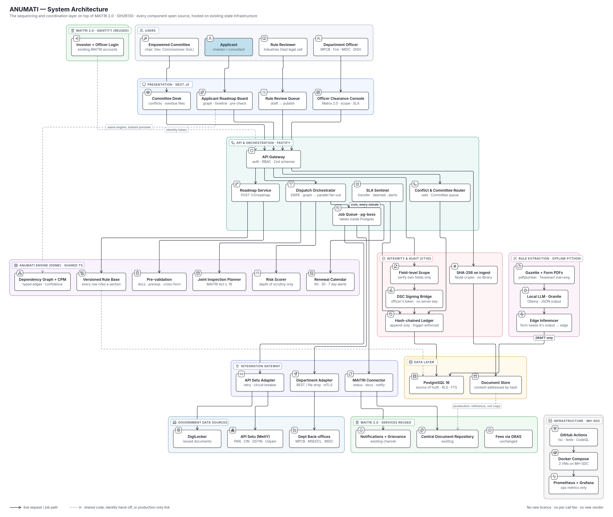

# ANUMATI (SIH26130) — System Architecture, in full

| | |
|---|---|
| What this is | Every component, every table, every request path, every failure mode — how ANUMATI works as a system, not as a set of screens |
| Diagrams | `anumati-architecture.png` (full, for this document) · `anumati-architecture-slide.png` (16:9, for slide 3) |
| Stack decisions | `ANUMATI_TECH_STACK.md` — this document assumes them |
| Status labels | **Built** runs today (frontend + `anumati-server`, tested) · **Recorded / Demo signer** works end to end but stands in for a government system this build cannot reach · **To build** designed here only. Status as of 27 Sep 2026 |
| Written | 26 Sep 2026 |



---

## 1. What the system is, in one paragraph

ANUMATI is the **sequencing and coordination layer that sits on top of MAITRI
2.0**. MAITRI tells an investor *what* to file. ANUMATI works out *in what
order*, checks the file *before* it is filed, sends it to *every department at
the same instant*, runs a clock against each department, routes lapses,
grievances and conflicts to the Empowered Committee the MAITRI Act already
created, and records every decision in a ledger that shows if anyone has
edited it. It reuses MAITRI's login, document repository and notification
channel, calls government registries through API Setu, and runs on the State
Data Centre.

---

## 2. Six design rules — everything below follows from these

| # | Rule | What it forces |
|---|---|---|
| 1 | **Sit on MAITRI 2.0, never beside it** | No second login, no second document store, no second chatbot, no payments. ANUMATI adds order, pre-checks, parallel routing and conflict handling — nothing MAITRI already does |
| 2 | **One engine** | The code that computes the roadmap in the applicant's browser is the same package the server runs. For the same rules version and engine version, the number on the screen and the number in the database cannot disagree — and every response carries both versions so a mismatch is visible |
| 3 | **PostgreSQL is the source of truth** | Rules, applications, clocks, jobs, the ledger — one database. Anything else is a cache or a view |
| 4 | **No model and no score decides a clearance** | Risk scores set the *depth* of scrutiny. Extracted rules are *drafts*. The decision is always a statutory authority's — the department under its own Act, or the Empowered Committee under the relevant law once a file is transferred (MAITRI Act s. 5(3)) |
| 5 | **Every number cites a section** | A rule row cannot be stored without its source document and section — a database constraint, not a habit |
| 6 | **Tamper-evident, and honest about it** | History is append-only and hash-chained. The chain proves that recorded history has not been edited since it was written; with a real DSC it also proves which officer signed which exact file. It never proves that the file is true |

---

## 3. The layers, top to bottom

The full diagram has twelve groups (§3.10 covers the two existing-system groups
together). They are read top to bottom as the path a request takes.

### 3.1 Users

| Actor | What they do in ANUMATI | Which screen |
|---|---|---|
| **Applicant** — investor or their consultant | Answers six questions, sees the roadmap, fills the common form once, fixes pre-check gaps, answers queries, raises grievances | Applicant Roadmap Board |
| **Department Officer** — MPCB, Fire, MIDC, DISH, MSEDCL, CEIG, Labour … | Reviews *only* their own department's fields, raises queries, decides, signs | Officer Clearance Console |
| **Empowered Committee** — chaired by the Development Commissioner (Industries), MAITRI Act s. 6 | Decides lapsed files (s. 5), overdue files (s. 8(1)(c)), grievances (s. 8(1)(g)) and deadlocks; decisions binding (s. 9) | Committee Desk |
| **Rule Reviewer** — Industries Department legal cell | Reads each extracted rule against the bare act and publishes or rejects it | Rule Review Queue |

### 3.2 MAITRI 2.0 — identity (reused)

| Component | Role | Status |
|---|---|---|
| **Investor + Officer Login** | The accounts investors and officers already hold. ANUMATI accepts a signed identity token from MAITRI and never stores a password | Built: server accounts (scrypt, 8 h tokens) + demo accounts · MAITRI token sign-in wired to JWKS, untested against the real issuer |

Why it matters: a second login is the most visible sign of a second portal.
Reusing MAITRI's is what makes "layer on top" true rather than a slogan.

### 3.3 Presentation — Next.js 14

Two products, not two tabs. `AuthGate` hard-redirects the wrong role away —
an officer typing the applicant URL lands on `/matrix`, and the reverse.

| Screen | Route | Contents | Status |
|---|---|---|---|
| **Applicant Roadmap Board** | `/roadmap/{id}` | Four headline numbers · dependency graph (critical path / all) · timeline with SLA windows · all approvals with citations · document ledger · pre-check (readiness, risk, renewals, inspections, grievance) | Built |
| **Officer Clearance Console** | `/matrix` | File queue · dispatch · parallel clocks · conflict banner · decision bar (own department only) · context rail: thread, data matrix, scope, SLA, visits, redress, audit | Built |
| **Committee Desk** | inside `/matrix` (tie-breaker screen) | Deadlocked and lapsed files, the named rule, the decision | Built — `/committee`: transferred, deadlocked, overdue, grievances |
| **Rule Review Queue** | — | Draft rules with extracted text, page reference and proposed edges; publish / reject | Built — `/rules`: drafts with excerpt/page/edges; publish (cycle-checked) / reject |
| **Open standard (OAGS)** | `/standard` | Schema, export, validation of an approval graph | Built |

The applicant board computes the roadmap **in the browser** using the shared
engine, so answers change the graph instantly (the dashed "same engine" line on
the diagram). When the file is filed, the server recomputes with the same
package and that result is the one recorded.

### 3.4 API & Orchestration — Fastify

| Component | Responsibility | Key behaviour | Status |
|---|---|---|---|
| **API Gateway** | Single entry point | Verifies the MAITRI identity token · role-based access (applicant / officer / committee / reviewer) · validates every body with the shared Zod schema · rejects any officer write to a field group their department does not own | Built — `anumati-server` (Fastify): token auth, per-role and per-desk checks, Zod on every body |
| **Roadmap Service** | `POST /v1/roadmap` | Loads the rule version in force at that moment, runs the engine, stores the roadmap with `rules_version` and `engine_version`. At filing, that version is pinned to the file for its whole life | Built — stored with rules/engine version; pinned at filing |
| **Dispatch Orchestrator (SWPE)** | Parallel workflow | On filing: enqueue one job per department whose prerequisites are met, all in one transaction. On every issued or deemed approval: ask the graph what just unlocked and enqueue those | Built — server, one transaction; wave release on every grant |
| **SLA Sentinel** | The clocks | A pg-boss cron job, every minute. Runs **two clocks** per department review, both computed from the event log: the service time limit (notified under MAITRI Act s. 18) and, where one exists, the parent Act's deemed period. See §6.4 for which acts first. Also raises renewal alerts | Built — worker cron every minute; two clocks; query pause |
| **Conflict & Committee Router** | Two departments disagree · Committee queue · grievances | Applies the file's named rule: **technical veto** (the rejecting authority's own Act stands; reasons recorded, s. 4(3)) or **Empowered Committee** (s. 6). Committee decisions are binding (s. 9); sending a *deadlock* to the Committee is this pilot's reading (see §6.5). Also owns the Committee queue (lapses, overdue files, grievances) | Built — server: rules, Committee queue, grievance routing |
| **Job Queue · pg-boss** | Durable work | Jobs are rows in PostgreSQL, claimed with `SKIP LOCKED`, retried with backoff, dead-lettered after N failures. A job and the state change that created it commit together, so a crash can never lose a dispatch | Built — pg-boss 12, enqueued in the same transaction |

### 3.5 ANUMATI Engine (DDME) — shared TypeScript package

Pure functions. No database access, no network, no clock — inputs in, results
out. That is what lets the browser and the server run the same code.

| Component | Input → output | File today | Status |
|---|---|---|---|
| **Versioned Rule Base** | Rule version + applicant answers → applicable approvals | `lib/data/maharashtraFood.ts`, `lib/data/engine.ts` | Built (seeded) |
| **Dependency Graph + CPM** | Approvals + typed edges → earliest start/finish, critical path, parallel batches | `lib/graph/criticalPath.ts` | Built |
| **Pre-validation** | Roadmap + dossier → blocking gaps (missing document, missing prerequisite, same quantity differing across forms) | `lib/compliance/prevalidate.ts` | Built |
| **Risk Scorer** | Hazard, boiler, height, headcount, pollution category, past rejections → Low / Medium / High | `lib/compliance/risk.ts` | Built — weights are a labelled pilot parameter |
| **Joint Inspection Planner** | Site-visit approvals + earliest start days → grouped visits (MAITRI Act s. 16) | `lib/compliance/inspections.ts` | Built |
| **Renewal Calendar** | Issued approvals + validity → renewal windows, 60 / 30 / 7-day alerts | `lib/compliance/renewals.ts` | Built (board) · alerts: worker job, sent through the recorded MAITRI adapter |

**The four edge types** the graph is built from — this is the novelty claim:

| Edge | Meaning | Confidence |
|---|---|---|
| Statutory | The Act or rule says B cannot be filed before A | 1.0 |
| Documentary | B's own application form asks for A's certificate | 0.9 |
| Physical | Impossible in the other order (inspect a building that exists) | 1.0 |
| Practice | Not law — how a desk behaves; shown dashed and flagged | 0.5 |

### 3.6 Integrity & Audit (CTVE)

| Component | What it does | What it proves | Status |
|---|---|---|---|
| **SHA-256 on ingest** | Hashes every uploaded file before anything else reads it; the hash becomes the file's name in the store | This exact file is the one that was submitted | Built — content-addressed store, type sniffed from bytes |
| **Field-level Scope** | Every form field belongs to a *parameter group*, and every group to one owning department. Only the owner can mark it verified | MIDC's signature on "site and structure" is context on MPCB's screen, never clearance for MPCB | Built — UI + server refuses another department's desk |
| **DSC Signing Bridge** | Sends the document hash to the officer's own Class 3 DSC; stores the detached signature, certificate serial and time. The server verifies, never signs | Which officer approved which exact file (IT Act 2000, s. 3 and s. 5) | Demo signer (Ed25519, labelled) · external DSC verification built |
| **Hash-chained Ledger** | Every decision, transfer, deemed approval and verification is appended; each row carries the previous row's hash | That history has not been edited since — or exactly where it was | Built — hash chain, triggers block edits, daily anchor, verify endpoint |

**What the integrity layer does *not* do**, and should never be claimed to:
it does not detect a forged document that was uploaded as a PDF, and it does
not detect a careless or bribed officer. Those are caught by pre-validation,
cross-form mismatch, registry verification, risk-led scrutiny (a pilot
parameter), joint and random inspection (s. 16), and — after the fact — by a
signed record of who cleared what.

### 3.7 Rule Extraction — offline, Python

Runs as a batch job when a gazette or form changes. Never in a request path.

| Step | Tool | Output |
|---|---|---|
| 1. Parse | **pdfplumber** for digital PDFs; **Tesseract** with English + Marathi packs for scans | Text with a page map |
| 2. Extract | **IBM Granite 4.1** (Apache 2.0), local via Ollama, temperature 0, JSON output against a fixed schema | Draft approval: name, time limit, deemed clause, required documents, page and section |
| 3. Infer edges | **Edge inferencer** — if B's form requires a document that A issues, propose a *documentary* edge | Draft edges with rationale and evidence |
| 4. Validate | Cycle check, orphan check, duplicate check | Flags on the draft |
| 5. Review | Written to Postgres as **DRAFT only** → Rule Review Queue → a person publishes | A new rule *version*, never an edited row |

### 3.8 Data Layer

| Store | Holds | Notes |
|---|---|---|
| **PostgreSQL 16** | Rules (versioned), applications, per-approval state, SLA events, parameter ownership, ledger, jobs, grievances, inspections, renewals | Row-level security per department · full-text search over provisions · offered by MH-SDC |
| **Document Store** | The files, named by SHA-256 | Demo: a disk volume · Production: MAITRI 2.0's Central Document Repository, referenced by id + hash, never copied |

### 3.9 Integration Gateway

One adapter per external system. Every adapter has the same four behaviours:

1. **Idempotency key** on every call, so a retried job never files twice.
2. **Retry with exponential backoff**, then dead-letter to an officer's
   exceptions list — never silently dropped.
3. **Circuit breaker** — after repeated failures, stop calling and mark the
   source "unavailable" on the Data Matrix instead of timing out every request.
4. **Fixture mode** for the demo — recorded responses, including one deliberate
   mismatch, so the demo needs no network.

| Adapter | Talks to | Used for |
|---|---|---|
| **API Setu Adapter** | API Setu (MeitY) → PAN, CIN, GSTIN, Udyam where published; DigiLocker issued documents | Registry verification (the Data Matrix) · pulling prior approvals from their issuer |
| **Department Adapter** | Department back-offices — MPCB, MSEDCL, MIDC, Fire | Dispatch and status. REST with mTLS where an API exists; file-drop or officer-entered status where it does not |
| **MAITRI Connector** | MAITRI 2.0 | Application status back into MAITRI's tracker · document references · notifications and grievances through MAITRI's channel |

### 3.10 Government systems (existing, not built by ANUMATI)

API Setu · DigiLocker · department back-offices · MAITRI 2.0's document
repository, notifications and grievance system, fees via GRAS. ANUMATI calls
these; it replaces none of them.

### 3.11 Infrastructure — MH-SDC

| Piece | Setup |
|---|---|
| **Hosts** | Two VMs on the Maharashtra State Data Centre: *app VM* (web, api, workers) and *db VM* (PostgreSQL). Hosted under the Industries Department, which avoids the chargeback MH-SDC applies to corporations and boards |
| **Runtime** | Docker Compose. Services: `web` (Next.js), `api` (Fastify), `worker` (pg-boss consumers + SLA cron), `postgres`; `ollama` only on the machine that runs extraction |
| **CI** | GitHub Actions: lint → `tsc --noEmit` → unit tests → build → image. CodeQL for security scanning |
| **Backups** | Nightly `pg_dump` plus continuous WAL archiving to a second disk; one restore drill per month |
| **Observability** | Structured JSON logs · Prometheus + Grafana for API latency, queue depth, adapter errors (optional) |

---

## 4. Data model — the tables that carry the design

Only the columns that matter to the design are shown.

```sql
-- Rules are versioned, never edited. A citation is mandatory.
approval_version (
  approval_id        text,          -- 'A15'
  version            int,
  name               text,
  department_id      text,
  statutory_days     int,
  deemed_exists      boolean,
  deemed_days        int NULL,
  deemed_reference   text NULL,     -- 'Water Act 1974, s. 25(7)'
  source_document_id uuid NOT NULL, -- ⟵ no citation, no row
  section            text NOT NULL,
  valid_from         date NOT NULL,
  valid_to           date NULL,
  review_status      text,          -- draft | published | under_review
  PRIMARY KEY (approval_id, version)
);

dependency_version (
  from_approval text, to_approval text, version int,
  edge_type   text CHECK (edge_type IN ('statutory','documentary','physical','practice')),
  confidence  numeric,              -- 1.0 / 0.9 / 1.0 / 0.5
  rationale   text NOT NULL,
  evidence    text NULL
);

application (
  id text PRIMARY KEY,              -- 'APP-2026-0148'
  applicant_ref text,               -- MAITRI identity, not a copy of the person
  answers jsonb,                    -- the six answers
  rules_version text, engine_version text,
  filed_at timestamptz
);

-- One row per approval on a file; state is derived from events where possible.
application_approval (
  application_id text, approval_id text,
  state text,   -- locked | ready | dispatched | under_review | query_open
                -- | approved | rejected | deemed_approved | transferred_to_committee | issued
  department_id text,
  risk_band text                    -- low | medium | high
);

-- The clock. Elapsed time is computed from these, never stored.
sla_event (
  application_id text, approval_id text,
  kind text,  -- dispatched | query_raised | query_answered | decided | deemed | transferred
  at timestamptz, actor text, payload jsonb
);

-- Field-level ownership.
parameter_group (
  application_id text, group_id text,
  owner_department text,
  verified_by text NULL, verified_at timestamptz NULL, signature_ref text NULL
);

document (
  sha256 char(64) PRIMARY KEY,      -- content address
  application_id text, kind text, repository_ref text NULL, received_at timestamptz
);

-- Append-only, hash-chained.
decision_ledger (
  seq bigserial PRIMARY KEY,
  at timestamptz, actor text, kind text,
  application_id text, approval_id text NULL,
  inputs jsonb, outputs jsonb,
  rules_version text, engine_version text,
  document_sha256 char(64) NULL, signature_ref text NULL,
  prev_hash char(64) NOT NULL,
  row_hash  char(64) NOT NULL       -- sha256(prev_hash || canonical_json(this row minus row_hash))
);
-- Triggers raise on UPDATE, DELETE and TRUNCATE; TRUNCATE is also revoked from the app role.
-- Appends take pg_advisory_xact_lock(<ledger key>) so two writers never read the same prev_hash.
```

Also: `grievance`, `inspection_visit`, `renewal`, `review_task`, and pg-boss's
own `job` tables in a separate schema.

**Why these choices:**

- *Versioned rules, not edited rules:* a roadmap filed in February resolves
  against February's rules forever. Changing a row would silently change old
  answers.
- *Events, not a stored "days elapsed":* a correction to one event recomputes
  every clock correctly; a stored counter would be wrong after the first fix.
- *Content-addressed documents:* the same file uploaded twice is one row, and a
  signature over a hash cannot be moved to a different file.

---

## 5. API surface

```
POST /v1/roadmap                          answers → roadmap (engine, rules version)
GET  /v1/roadmap/{id}                     stored roadmap
POST /v1/applications                     file an application (common form)
POST /v1/applications/{id}/documents      upload → SHA-256 → store
POST /v1/applications/{id}/prevalidate    gaps before filing
POST /v1/applications/{id}/submit         pre-check must pass → dispatch
GET  /v1/applications/{id}/track          per-department state, clocks, events

GET  /v1/officer/queue                    files for my department
GET  /v1/applications/{id}/parameters     field groups with owners
POST /v1/applications/{id}/parameters/{g}/verify   REJECT unless my department owns g
POST /v1/applications/{id}/approvals/{a}/decide    approve | reject(reasons) | query
POST /v1/sign                             hash → officer DSC → detached signature

GET  /v1/committee/queue                  lapsed · overdue · grievance · deadlock
POST /v1/committee/{case}/decide          binding decision (s. 9)
POST /v1/grievances                       applicant, any stuck approval (s. 8(1)(g))

GET  /v1/rules/review                     draft rules
POST /v1/rules/{id}/publish               new version, never an edit

GET  /api/v1/standard/schema | export     OAGS  (built)
POST /api/v1/standard/validate            OAGS  (built)
GET  /v1/ledger/verify?from=&to=          recompute the chain, report the first break
```

Every response carries `meta { rules_version, engine_version }` so any number
on any screen can be traced to the rules and code that produced it.

---

## 6. Seven request paths, step by step

### 6.1 Build a roadmap

1. Applicant answers six questions on the board. The **shared engine in the
   browser** draws the graph immediately.
2. On save, `POST /v1/roadmap`. The gateway validates the answers with the Zod
   schema.
3. Roadmap Service loads the rule version in force at that moment, runs the
   **same** engine, stores the result with `rules_version` and
   `engine_version`. When the application is filed, that version is pinned to
   the file.
4. A ledger row records inputs, outputs and versions.

*Demo numbers* (food processing, MIDC Chakan, 72 staff, boiler): 31 approvals
across 21 departments; 464 days if filed one after another; 223 days on the
critical path. Modelled from notified time limits, not measured.

### 6.2 Upload and pre-validate

1. Each file is hashed with SHA-256 on arrival; stored under its hash;
   `document` row written.
2. Where the applicant consents, prior approvals are pulled from DigiLocker via
   API Setu rather than uploaded — a pulled approval is trusted as a
   prerequisite, an uploaded PDF is only a document.
3. `POST /prevalidate` runs three checks on the approvals being filed **now**
   (the current wave): required documents present; their prerequisites
   already issued — later-wave approvals are expected to wait in `locked`, so
   they are not gaps; the same quantity equal on every form (plot number,
   built-up area, connected load in kVA, water draw in KLD).
4. Any gap blocks submission and is shown in plain words — for example,
   *"Connected load declared as 1250 kVA on A11, 1600 kVA on A22."*

### 6.3 Submit and dispatch in parallel

1. `POST /submit` re-runs pre-validation on the server — the browser's pass is
   never trusted.
2. Registry checks run through the API Setu adapter. A mismatch is **flagged**
   on the officer's Data Matrix — it does not auto-reject.
3. The risk scorer sets Low / Medium / High for each approval's scrutiny depth.
4. In **one transaction**: every approval whose prerequisites are satisfied
   moves to `dispatched`, one pg-boss job per department is enqueued, a
   `dispatched` SLA event is written, and a ledger row is appended.
5. Workers deliver through the department adapters. Failure retries;
   repeated failure goes to an exceptions list with the reason.

### 6.4 The SLA Sentinel tick (every minute)

1. For each dispatched approval not yet decided, read its `sla_event`s and
   compute elapsed time — time with a query open does not count (pilot rule;
   confirm against the time limits notified under MAITRI Act s. 18). The clock
   runs from dispatch, whether or not the department has opened the file.
2. Two limits can apply, and they are different numbers:
   - **Service time limit** (`statutory_days`, notified under s. 18) → on
     lapse, `transferred_to_committee`; the department loses power over the
     file (s. 5(2)); it enters the Committee queue (s. 5(1)).
   - **Deemed period** (`deemed_days`, only where the parent Act has one —
     e.g. four months for water consent, Water Act 1974 s. 25(7)) → on lapse,
     `deemed_approved`, citing that clause.
3. **Whichever lapses first acts; a transfer does not stop the parent Act.**
   Once transferred, the Committee holds the file, but the parent Act's deemed
   period keeps running — the MAITRI Act does not say it overrides a sectoral
   deeming clause. If the Committee has not decided by then, the approval is
   deemed. This is the pilot's reading, stated on screen; the Industries
   Department should confirm it. Both clocks start when that desk receives the
   file and pause while its own query is with the applicant.
4. Either outcome writes an SLA event and a ledger row; a deemed approval
   releases dependents exactly like an issued one.
5. Renewal alerts at 60, 30 and 7 days go out through MAITRI's notification
   channel.

### 6.5 Two departments disagree

1. The Conflict & Committee Router sees opposite decisions on linked parameters.
2. It applies the file's named rule, fixed before the conflict:
   - **Technical veto** — the rejection stands on the rejecting authority's
     own Act; reasons are recorded (s. 4(3)); the file returns to the
     applicant.
   - **Empowered Committee** — the case enters the Committee queue; the
     Committee's decisions are binding (s. 9), but routing a *deadlock* there
     is this pilot's reading of the Act (see the note below).
3. The rule, the reasons and the outcome are appended to the ledger.

*Honest note for Q&A:* the Act sends files to the Committee on delay (s. 5)
and on grievance (s. 8(1)(g)); it has no clause headed "two departments
disagree". Say "closest enacted route", not "the Act mandates this".

### 6.6 Decide, sign, record, release

1. The officer decides on **their own department's** fields only; the gateway
   rejects anything else.
2. The document hash goes to the officer's DSC; the detached signature returns.
3. A ledger row is appended with the decision, the document hash and the
   signature reference.
4. The Dispatch Orchestrator asks the graph which approvals just became
   unlocked and dispatches that next wave. When nothing is left, the unit can
   commence and the renewal calendar takes over.

### 6.7 A rule changes

1. A new gazette or form enters the offline pipeline.
2. Drafts land in the Rule Review Queue with page and section references.
3. A reviewer publishes: a **new version** with `valid_from`. Old roadmaps keep
   resolving against their old version.

---

## 7. One approval's lifecycle

| From | To | Triggered by | Recorded as |
|---|---|---|---|
| — | `locked` | Roadmap built; prerequisites not yet issued | — |
| `locked` | `ready` | Last prerequisite issued | ledger |
| `ready` | `dispatched` | Submit, or next-wave release | SLA event + ledger |
| `dispatched` | `under_review` | Department opens it | SLA event |
| `dispatched` or `under_review` | `transferred_to_committee` | Service time limit lapses — opened or not (s. 5) | SLA event + ledger |
| `under_review` | `query_open` | Officer raises a query (clock stops) | SLA event |
| `query_open` | `under_review` | Applicant answers (clock resumes) | SLA event |
| `under_review` | `approved` / `rejected` | Officer decides, signs with DSC | SLA event + ledger (signed) |
| `dispatched` or `under_review` | `deemed_approved` | Parent Act's deemed period lapses first | SLA event + ledger |
| `deemed_approved` | `issued` | Deemed order recorded; dependents released | ledger |
| `rejected` | `ready` | Applicant corrects and resubmits; pre-validation passes again | ledger |
| `transferred_to_committee` | `approved` / `rejected` | Committee decides under the relevant law (s. 5(3)) | ledger |
| `approved` | `issued` | Certificate issued | ledger; dependents released |

---

## 8. Security and integrity

### 8.1 Who can do what

| | Applicant | Officer | Committee | Reviewer |
|---|---|---|---|---|
| Read own roadmap and file | ✓ | — | — | — |
| Read a file dispatched to their department | — | ✓ whole file | ✓ | — |
| Verify / decide a field group | — | only groups their department owns | only on cases in its queue | — |
| Publish a rule | — | — | — | ✓ |
| Edit a ledger row | nobody | nobody | nobody | nobody |

*Read-all, write-restricted:* an officer needs the whole file to judge their
part of it, and may clear only their part. The rule is enforced by the
gateway and by row-level security — a disabled button is a convenience, not a
control.

### 8.2 The hash chain

```
row_hash(n) = SHA-256( prev_hash(n) ‖ canonical_json(row n without row_hash) )
prev_hash(n) = row_hash(n − 1)          prev_hash(1) = 64 zeros
```

- **Verify:** recompute from row 1 (or from the last anchored checkpoint);
  report the first row whose stored hash differs.
- **Anchor:** each day's final `row_hash` is published outside the database
  administrator's control — for example, a signed daily email to the
  Supervisory Committee's (s. 10) secretariat. A superuser who rewrites the
  whole chain then cannot match yesterday's published hash. *(This is a
  proposed practice, not an existing report.)*
- **Single writer:** appends take a transaction-scoped advisory lock, so two
  simultaneous decisions cannot both chain onto the same `prev_hash`.
- **No shortcuts:** UPDATE, DELETE and TRUNCATE are blocked by triggers and
  TRUNCATE is revoked from the application role.
- **Say:** tamper-evident. **Do not say:** immutable, blockchain.

### 8.3 Threats and what answers each

| Threat | Answer |
|---|---|
| Applicant uploads a fake prior approval | Prerequisites are pulled from the issuer (DigiLocker / department); an upload is never accepted as a prerequisite |
| Applicant swaps a document after approval | Signature is over the SHA-256 of the exact file; a different file has a different hash |
| Officer approves outside their remit | Gateway rejects writes to field groups they do not own |
| Careless or bribed officer approves a bad plan | Not detected by crypto. Caught by pre-validation, cross-form mismatch, registry checks, risk-led scrutiny, joint and random inspection (s. 16); the signed record shows who cleared what |
| Server compromise forges approvals | Server holds no signing key |
| Someone edits history in the database | Chain breaks at that row; daily anchor exposes a full rewrite |
| A department system is down | Circuit breaker; status shows "source unavailable"; job retries; nothing is silently skipped |

---

## 9. Deployment

```
MH-SDC ─┬─ app VM ── docker compose ── web (Next.js) · api (Fastify) · worker (pg-boss, SLA cron)
        └─ db VM ─── PostgreSQL 16 ── WAL archive → second disk · nightly pg_dump
   extraction machine (offline, as needed) ── Python pipeline · Ollama + Granite 4.1
```

| Environment | What differs |
|---|---|
| **SIH demo** | One laptop, `docker compose up`; adapters in fixture mode; mock DSC; seeded rules and three matrix files. No internet needed |
| **District pilot** | Two MH-SDC VMs; live API Setu adapter; MAITRI login token; officers' DSCs; one sector, one district |
| **State rollout** | Same two-VM shape, larger VMs; a read replica if reporting gets heavy. The design does not need Kubernetes at state scale |

---

## 10. Performance, stated carefully

- The dependency graph for one file is tens of nodes; the critical path is
  computed in milliseconds on a laptop. No GPU, no graph database.
- Even tens of thousands of applications a year is well under one request per
  second on average. The design target is correctness and auditability, not
  throughput — do not claim throughput on a slide.
- The heaviest job is offline extraction (a local model on a CPU VM). It runs
  when a law or form changes, not per application.

---

## 11. Failure modes

| Failure | What the system does | What a person sees |
|---|---|---|
| API Setu or a registry is down | Circuit opens; check marked "source unavailable"; retried later | Officer sees the unverified field, not a spinner |
| Department adapter fails repeatedly | Job dead-lettered with reason | Exceptions list on the officer console |
| Worker crashes mid-dispatch | Job and state change were one transaction; the job is still there | Nothing — it resumes |
| Two officers act at the same moment | Row-level lock on the approval; second write sees the new state | "Already decided by …" |
| Rule extraction proposes a wrong edge | It is a draft; the reviewer rejects it | Nothing reaches applicants |
| A law changes mid-application | New rule version; filed roadmaps keep their version | Version banner on the roadmap |
| Clock dispute | Recompute from events; every pause and resume is on record | The full event history for that approval |

---

## 12. Demo vs production, one table

| Capability | SIH demo | Production |
|---|---|---|
| Identity | Two demo accounts | MAITRI 2.0 token |
| Engine | Shared TS package in browser | Same package on the server (authoritative) |
| Storage | Browser state + seed files | PostgreSQL 16 |
| Dispatch & clocks | Simulated clock in the console | pg-boss jobs + SLA cron |
| Registry checks | Fixture responses, one mismatch | API Setu adapter |
| Signing | Mock, labelled | Officer DSC |
| Ledger | Audit tab | Hash-chained table + daily anchor |
| Extraction | Seeded outputs | Offline Python pipeline + review queue |
| Hosting | Laptop | Two MH-SDC VMs |

---

## 13. Honest gaps

- Government systems are **recorded answers** (`ADAPTER_MODE=fixture`). The live
  adapters (retries, circuit breaker, idempotency keys) exist but have never
  called API Setu, MAITRI or a department endpoint — no credentials.
- Signing in the demo is a **labelled demo signer** (Ed25519 derived from the
  server secret). `DSC_MODE=external` verifies a real DSC signature against the
  officer's certificate; chain validation to the CCA root is the deployment's
  trust store and is not configured here. Production refuses the demo signer.
- MAITRI single sign-on verifies a token against a configured JWKS but has not
  been tested against MAITRI's real issuer.
- The extraction pipeline is built and tested with a stubbed model; it has not
  yet been run against real gazettes with a real local model. Its output is
  always a draft a reviewer publishes.
- Delay analytics for the Committee are not built; the reform simulator is.
- The query-pause rule and the risk weights are pilot parameters, not notified
  law.
- MRTP s. 45(5), Factories s. 6(2) and the FSSAI regulation number are cited in
  the seed but not yet checked against the bare act.
